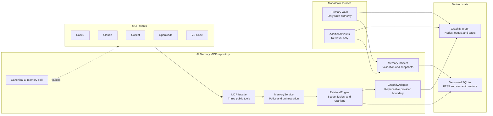
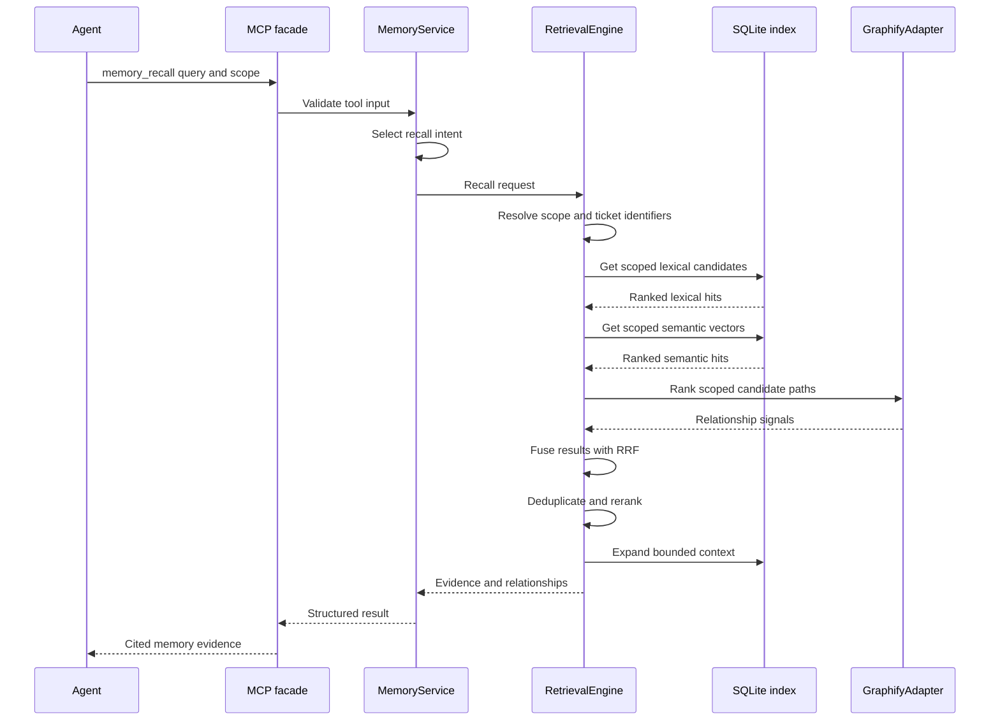
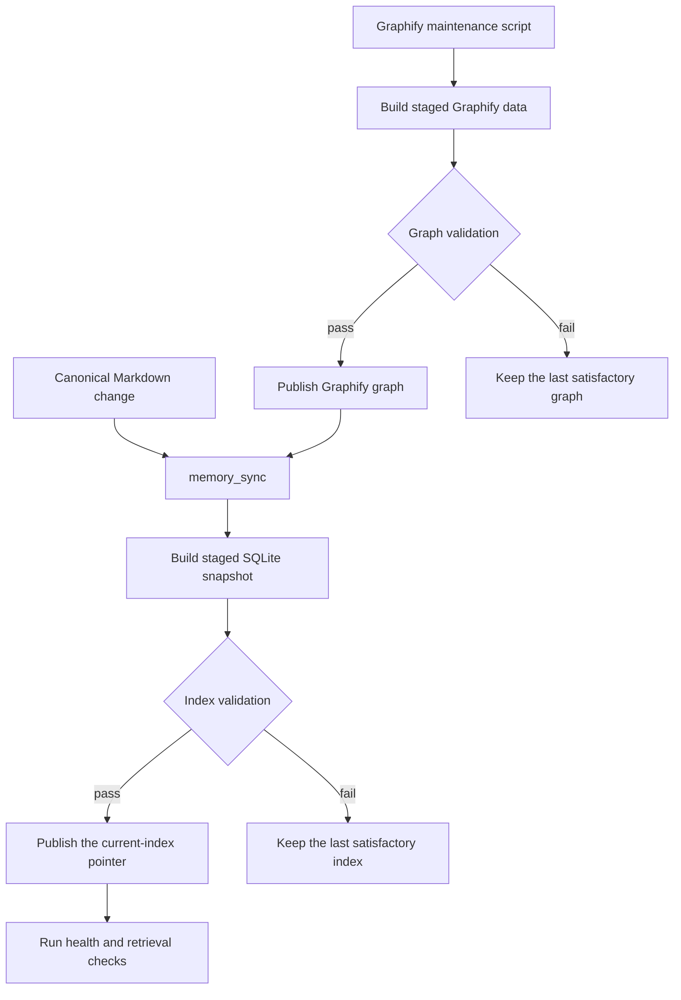

# AI Memory MCP

AI Memory MCP gives agents one stable interface for durable memory.
The server combines exact, lexical, semantic, and graph search results.

The primary Markdown vault is the only write authority.
Additional Markdown vaults are retrieval-only sources.
The system derives SQLite indexes and Graphify graphs from Markdown.

## Architecture decision

The system is built around Graphify.
Graphify remains a replaceable provider behind the stable AI Memory MCP interface.

The MCP facade owns scope, ranking, evidence, health, and refresh control.
Clients do not depend on Graphify commands, files, or response formats.

This boundary permits a future graph-provider change without a client configuration change.
Read the complete [architecture guide](docs/architecture.md) for the design rules.

## System architecture



## Main components

| Component | Responsibility |
|---|---|
| Primary Markdown vault | Stores all new durable records. |
| Retrieval-only vaults | Supply additional records without receiving writes. |
| Memory indexer | Validates records and publishes versioned SQLite snapshots. |
| SQLite FTS5 | Supplies exact and lexical candidates. |
| Local semantic index | Supplies paraphrase candidates without an external API. |
| Graphify adapter | Supplies relationships, neighbors, and paths. |
| Retrieval engine | Applies scope, RRF fusion, reranking, and context expansion. |
| MCP facade | Supplies the stable public tools and evidence packets. |
| Canonical skill | Gives agents the memory workflow and safety rules. |
| Client installer | Registers the MCP server and repository-linked skill stubs. |

## Query architecture

`memory_recall` is the only recall tool.
The service selects exact, search, neighbor, or relationship behavior.
The retrieval engine combines all provider work internally.



The engine applies scope before it ranks each provider result.
Exact identifiers receive bounded bonuses during reranking.

Graph traversal contributes one retrieval signal.
It does not replace lexical or semantic retrieval.

## Refresh architecture

`memory_sync` updates SQLite after a normal Markdown change.
The maintenance script rebuilds the Graphify graph.



The maintenance script uses staging, validation, publication, health checks, and rollback.
A failed rebuild does not change the Markdown authority.

## Reliability and performance

- The repository pins Graphify 0.9.26 in an isolated environment.
- Scope filters run before provider ranking.
- RRF combines independent provider rankings.
- Bounded reranking limits query work.
- One query loads context for all returned records.
- Recall results omit internal provider diagnostics.
- Incremental indexing skips unchanged Markdown files.
- Versioned snapshots preserve the last satisfactory index.
- Full graph refreshes validate staged data before publication.
- Evidence packets include canonical source paths.
- Source IDs keep identical vault paths separate.

## Quick start

AI Memory MCP runs on Windows, macOS, and Linux.

Install these items:

- Git
- Python 3.11 or later
- A Markdown memory directory

Windows additionally requires PowerShell 5.1 or later if you use the `.ps1`
entry points.

Open a terminal in the repository root.
Then, run the command for your platform.

Windows (PowerShell):

```powershell
.\scripts\setup.ps1 -MemoryRoot 'C:\path\to\AI-Memory' -InstallClients
```

macOS and Linux:

```bash
./scripts/setup.sh --memory-root ~/AI-Memory --install-clients
```

Every maintenance script has a `.ps1` wrapper, a `.sh` wrapper, and one shared
Python implementation, so either shell produces the same result.

Restart each configured client after the setup procedure is complete.

For more setup information, read the [installation guide](docs/installation.md).

## MCP tools

| Tool | Function |
|---|---|
| `memory_recall` | Returns cited evidence and applicable relationships. |
| `memory_sync` | Updates the derived index from canonical Markdown. |
| `memory_status` | Reports source, index, Graphify, and runtime status. |

## Repository layout

| Path | Contents |
|---|---|
| `src/ai_memory_mcp/` | MCP server, retrieval engine, indexer, and adapters |
| `scripts/` | Setup, client installation, and Graphify operations |
| `skill/ai-memory/` | Canonical AI Memory skill |
| `graphify-codebase/` | Independent codebase-indexing skill and wrapper |
| `tests/` | Automated behavior and portability tests |
| `benchmarks/` | Frozen retrieval contract and fixtures |
| `docs/` | Architecture, setup, operations, and validation guides |

## Documentation

The [documentation index](docs/README.md) gives links to all project guides.

- [Installation](docs/installation.md)
- [Configuration](docs/configuration.md)
- [Operations](docs/operations.md)
- [Architecture](docs/architecture.md)
- [Development](docs/development.md)
- [Validation](docs/validation-report.md)
- [Writing standard](docs/writing-standard.md)

## Skill discovery stubs

This repository contains two canonical skills:

- `skill/ai-memory/SKILL.md`
- `graphify-codebase/skill/graphify/SKILL.md`

AI harnesses must contain discovery stubs instead of canonical skill copies.
The stubs keep one source of truth and support repository moves.

Use this stub pattern:

```markdown
---
name: <canonical-name>
description: <copy the exact canonical description>
---

Before following this stub, read the canonical `SKILL.md` in full from `<canonical-path>`.
```

Run `.\scripts\install-clients.ps1` (or `./scripts/install-clients.sh`) after a
clone or repository move.
The installer writes the correct canonical path into each stub.

Read the [Graphify Codebase guide](graphify-codebase/README.md) for its independent boundary.

## Source boundary

This is a public repository.
This repository contains all project source files.
It contains only neutral examples and synthetic benchmark fixtures.
The user memory directory stays outside Git.
Generated indexes, logs, and recovery files also stay outside Git.
Machine-specific and organization-specific values stay in the ignored `.env` file.

Read [AGENTS.md](AGENTS.md) before you change this repository.
