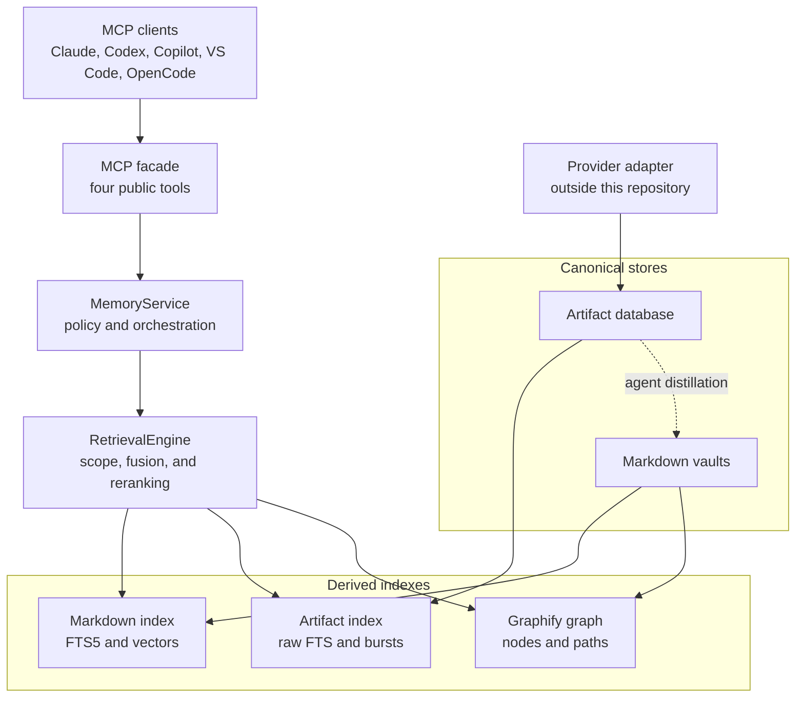
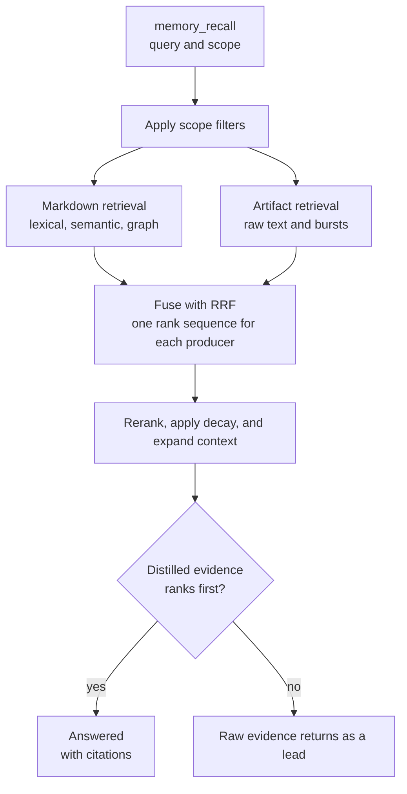
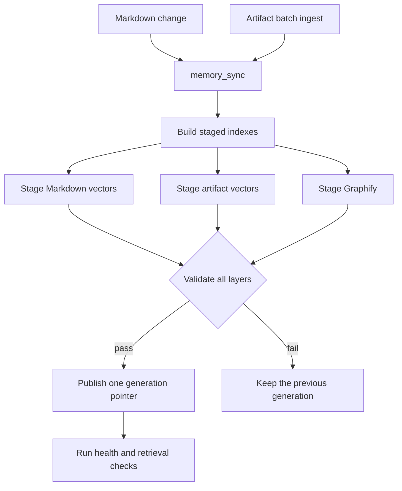

# AI Memory MCP

AI Memory MCP gives agents one stable interface for durable memory.
The server combines exact, lexical, semantic, and graph results into cited evidence.

## Two canonical stores

The system keeps two classes of data, and each class has one authority.

| Data class | Authority | Contents |
|---|---|---|
| Distilled memory | Markdown vaults | Summaries, decisions, resolutions, and durable facts |
| Raw artifacts | Artifact database | Chats, meetings, transcripts, revisions, and tombstones |

The primary Markdown vault is the only Markdown write authority.
Additional Markdown vaults are retrieval-only sources.
A provider adapter supplies raw artifacts through validated batches.

Each authority stays inside its own class.
A Markdown file never becomes authoritative for a transcript.
The artifact database never becomes authoritative for an agent summary.

All retrieval indexes are derived data.
The system rebuilds each index from its own canonical store.

AI Memory keeps internal data under `AI_MEMORY_WORK_DIR/.ai-memory/`.
The hidden directory keeps raw data, backups, indexes, state, and logs separate from Markdown notes.

Read the [architecture guide](docs/architecture.md) for the complete design rules.

## System architecture



The provider adapter owns authentication, paging, and remote cursors.
AI Memory owns validation, storage, search, and citations.

## Main components

| Component | Responsibility |
|---|---|
| Primary Markdown vault | Stores all new distilled records. |
| Retrieval-only vaults | Supply extra records without receiving writes. |
| Artifact database | Stores each raw message and transcript cue as one record. |
| Object storage | Holds attachment bytes by content hash, outside SQLite. |
| Memory indexer | Validates records and publishes versioned SQLite snapshots. |
| Artifact search | Supplies raw candidates from a full-text index. |
| Burst index | Supplies paraphrase candidates from same-author message runs. |
| Local semantic index | Supplies paraphrase candidates with Model2Vec embeddings or a hashed fallback. |
| Graphify adapter | Supplies relationships, neighbors, and paths behind a replaceable boundary. |
| Retrieval engine | Applies scope, RRF fusion, reranking, and context expansion. |
| MCP facade | Supplies the stable public tools and evidence packets. |
| Canonical skill | Gives agents the memory workflow and safety rules. |

## Query architecture

`memory_recall` is the only recall tool.
The service selects exact, search, neighbor, or relationship behavior.
The retrieval engine combines all provider work internally.



The engine applies scope before it ranks each provider result.
Each producer owns its own rank sequence, so no producer loses weight through list order.
Exact identifiers receive bounded bonuses during reranking.

Raw artifact evidence answers a question only on an exact identifier or an exact quoted phrase.
Every other raw result returns as a lead with a caution to verify or distill it first.
Raw evidence also decays with age, and chat decays faster than a meeting.

Use `memory_artifact_read` to read ordered source context around an `artifact://` citation.

## Refresh architecture

`memory_sync` publishes one coordinated derived generation after a canonical change.



Each recall pins one published generation and one artifact database read snapshot.
The recall never combines components from different generations.

The system retains the active generation and one verified previous generation.
Retention removes only derived snapshots.
Retention never removes canonical artifacts or required object files.

A failed refresh never changes either canonical store.

## Command-line tools

| Command | Function |
|---|---|
| `ai-memory-mcp` | Runs the MCP server. |
| `ai-memory-index` | Builds the derived Markdown index. |
| `ai-memory-artifact` | Manages the canonical artifact database. |
| `ai-memory-benchmark` | Runs the frozen retrieval benchmark. |

`ai-memory-artifact` is the only write path for raw artifacts.
It supplies `ingest`, `search`, `read`, `pending`, `backup`, `check`, and `restore`.
The MCP facade never exposes an artifact write operation.

## MCP tools

| Tool | Function |
|---|---|
| `memory_recall` | Returns cited Markdown and artifact evidence. |
| `memory_artifact_read` | Returns ordered raw context for one artifact reference. |
| `memory_sync` | Publishes one coordinated generation after a canonical change. |
| `memory_status` | Reports strict health for every required layer. |

## Reliability and performance

- The repository pins Graphify 0.9.26 in an isolated environment.
- Scope filters run before provider ranking.
- RRF combines independent provider rankings.
- Bounded reranking limits query work.
- One query loads context for all returned records.
- Recall results omit internal provider diagnostics.
- Incremental indexing skips unchanged Markdown files.
- Incremental artifact indexing skips unchanged bursts.
- Large vector corpora use ANN candidates with exact reranking.
- Versioned generations preserve the last satisfactory state.
- Recall uses only components from one generation.
- Health reports missing and stale layers.
- Artifact intake validates a complete batch before it changes SQLite.
- Artifact backups verify a restored copy against the same digest.
- A redaction moves object bytes to quarantine, because the project never deletes a file.
- Evidence packets include canonical source paths and artifact references.
- Source IDs keep identical vault paths separate.

## Quick start

AI Memory MCP runs on Windows, macOS, and Linux.

Install these items:

- Git
- Python 3.11 or later
- A Markdown memory directory

Windows additionally requires PowerShell 5.1 or later if you use the `.ps1`
entry points.

Open a terminal in the repository root.
Then, run the command for your platform.

Windows (PowerShell):

```powershell
.\scripts\setup.ps1 -MemoryRoot 'C:\path\to\AI-Memory' -InstallClients
```

macOS and Linux:

```bash
./scripts/setup.sh --memory-root ~/AI-Memory --install-clients
```

Every maintenance script has a `.ps1` wrapper, a `.sh` wrapper, and one shared
Python implementation, so either shell produces the same result.

Restart each configured client after the setup procedure is complete.

For more setup information, read the [installation guide](docs/installation.md).
For agent setup, read the [AI agent setup guide](docs/agent-new-system-setup.md).

## Repository layout

| Path | Contents |
|---|---|
| `src/ai_memory_mcp/` | MCP server, retrieval engine, indexer, and adapters |
| `src/ai_memory_mcp/artifacts/` | Artifact schema, intake, search, bursts, and backup |
| `scripts/` | Setup, client installation, and Graphify operations |
| `skill/ai-memory/` | Canonical AI Memory skill |
| `graphify-codebase/` | Independent codebase-indexing skill and wrapper |
| `tests/` | Automated behavior and portability tests |
| `benchmarks/` | Frozen retrieval contract and fixtures |
| `docs/` | Architecture, setup, operations, and validation guides |

## Documentation

The [documentation index](docs/README.md) gives links to all project guides.

- [Installation](docs/installation.md)
- [Configuration](docs/configuration.md)
- [Operations](docs/operations.md)
- [Architecture](docs/architecture.md)
- [Artifact storage](docs/artifact-storage.md)
- [Development](docs/development.md)
- [Validation](docs/validation-report.md)
- [Writing standard](docs/writing-standard.md)

## Skill discovery stubs

This repository contains two canonical skills:

- `skill/ai-memory/SKILL.md`
- `graphify-codebase/skill/graphify/SKILL.md`

AI harnesses must contain discovery stubs instead of canonical skill copies.
A stub carries only the metadata a host needs to discover and trigger the
skill, then redirects to the canonical `SKILL.md`. This keeps one source of
truth and survives repository moves.

Use this stub pattern:

```markdown
[Add any host-specific skill metadata here if the target platform expects a
header before YAML frontmatter]

---
name: <canonical-name>
description: <copy the exact canonical description>
---

Before following any instruction in this stub, first check the canonical skill
header in '<canonical-path>'. If the source skill metadata has changed and this
stub is out of date, update this stub to match the current source skill
metadata before proceeding.

Then read the SKILL.md in full from '<canonical-path>'
```

Rules:

- Keep the stub folder name exactly the same as the canonical skill folder.
- Copy the canonical `description` exactly, so host triggering is unchanged.
- Copy any other metadata the target platform requires for discovery, in the
  header format and location that platform expects.
- The stub must tell the agent to compare its own header against the canonical
  header and update itself whenever the canonical metadata changes. A stale
  description stops a host from triggering the skill at all.
- Never copy the canonical skill body into a stub.

Run `.\scripts\install-clients.ps1` (or `./scripts/install-clients.sh`) after a
clone or repository move.
The installer writes the correct canonical path into each stub.

Read the [Graphify Codebase guide](graphify-codebase/README.md) for its independent boundary.

## Source boundary

This is a public repository.
This repository contains all project source files.
It contains only neutral examples and synthetic benchmark fixtures.
The user memory directory stays outside Git.
Generated indexes, logs, and recovery files also stay outside Git.
Machine-specific and organization-specific values stay in the ignored `.env` file.

Read [AGENTS.md](AGENTS.md) before you change this repository.
