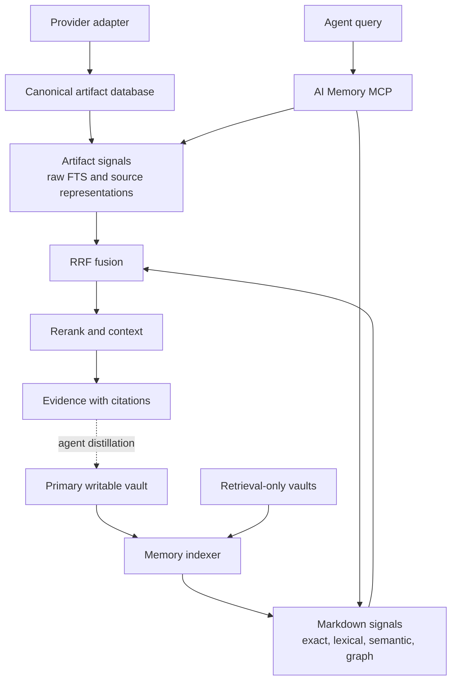

# Architecture

The [retrieval reliability design](retrieval-reliability-design.md) defines complex-query, historical-message, meeting, and large-collection behavior.
The [implementation plan](retrieval-reliability-implementation-plan.md) records the reliability work and remaining evaluation.
This work excludes sentence-derived criterion filtering.

## Decision

AI Memory MCP uses Graphify as an internal graph provider.
The system does not expose Graphify as its permanent public interface.

Agents use the stable AI Memory MCP tools.
The MCP server owns scope, ranking, freshness, evidence, health, and refresh control.

## Source authority

Markdown files in all configured vaults are durable-memory source data.
The primary vault is the only Markdown write authority.
Additional vaults are retrieval-only sources.
The canonical artifact database is the write authority for raw external artifacts.

The system derives memory indexes from Markdown.
The system derives artifact search and semantic representation indexes from the canonical artifact database.

Raw artifacts never make a Markdown file authoritative for a transcript or chat log.
Distilled Markdown never makes the artifact database authoritative for an agent summary.

A failed refresh does not change either authority.

## Internal data layout

`AI_MEMORY_WORK_DIR` is the single configured root for Markdown and internal data.
AI Memory stores implementation data in the hidden `.ai-memory` directory.

```text
AI_MEMORY_WORK_DIR/
├── <Markdown memory directories>
└── .ai-memory/
    ├── raw/
    │   ├── artifacts.sqlite3
    │   └── objects/
    ├── backups/
    ├── migration/
    ├── provider-state/
    ├── indexes/
    └── logs/
```

The indexer excludes hidden directories from Markdown discovery.
Explicit environment overrides remain available for existing and advanced installations.

## System flow



Each signal group supplies its own ranked view.
Fusion combines those views, and no group receives a rank penalty from list order.

## Components

### Markdown memory

The configured primary vault receives all new records.
Named additional vaults supply retrieval-only records.
Each durable record has an identity, scope, status, dates, and provenance.

### Memory indexer

The indexer reads changed Markdown files from all configured vaults.
It validates identity and metadata.
It skips unchanged content.
It publishes a versioned SQLite snapshot.
It prefixes each indexed path with its source ID.
It creates compact aliases for memory identities and scopes.
It does not modify a configured vault.
It updates vectors only for changed Markdown chunks.
Large vector searches use an ANN candidate index before exact reranking.
Portable installations use exact search when the ANN backend is unavailable.

### Exact and lexical retrieval

SQLite FTS5 supplies exact and lexical results.
Exact matches get priority for identifiers, paths, filenames, and error text.
Repository filters accept the canonical ID, owner and repository, repository name, or encoded folder name.
Narrow scopes can combine independently corroborated evidence from multiple notes.

### Semantic retrieval

A local embedding provider supplies paraphrase results.
The default provider is Model2Vec with the `minishlab/potion-base-8M` model.
The hashed feature provider is the automatic fallback.
The semantic index stays local and does not need an external API.

The index records the embedding provider that built it.
A query always uses the recorded provider.
A provider change makes the indexer build all vectors again.
If the recorded provider is not available, recall disables the semantic signal and gives a warning.

Each nonempty message and transcript passage gets a base representation.
Long source text uses overlapping segments that cover the complete text.
Timestamp-free transcript passages use provider order or stable source order.
Reply-aware representations include the explicit reply target before nearby messages.
Each result still cites its canonical anchor record.

### Graphify provider

Graphify supplies graph nodes, edges, neighbors, and paths.

The graph build makes an edge from three sources.
A `primary_scope` value makes a `belongs-to` edge.
A frontmatter `related` entry makes a `declared-related` edge.
A body wikilink makes a `body-link` edge.
The build reports unresolved and ambiguous link counts separately.
The repository pins Graphify 0.9.26 in an isolated environment.

The routine refresh builds a Graphify-compatible graph from the current SQLite index.
This build covers all configured memory sources without an extraction API.

The graph contains one node for each indexed document.
The graph also contains declared relationships and shared-scope relationships.

Semantic Graphify extraction remains an optional maintenance operation.
It does not control routine memory availability.

The provider adapter hides Graphify file formats from MCP clients.
The adapter keeps Graphify replaceable.
Graph traversal applies all requested scopes before it follows an edge.
Weighted traversal permits controlled multi-hop evidence inside that scope.

### MCP facade

The MCP facade gives agents four public tools.
The facade applies scope rules before retrieval.
The facade returns source paths and retrieval evidence.
The facade runs recall in a bounded pool of supervised worker processes.
Each worker keeps immutable generation data and local models warm.
Queue time is part of the recall deadline.
The facade rejects work when the bounded queue is full.
The facade stops and reaps the worker when the recall deadline expires.
The facade also stops the assigned worker after client cancellation.
Process termination closes the worker generation lease and SQLite snapshot.

| Tool | Function |
|---|---|
| `memory_recall` | Returns cited Markdown and artifact evidence. |
| `memory_artifact_read` | Returns ordered raw context for one artifact reference. |
| `memory_sync` | Publishes one coordinated derived generation. |
| `memory_status` | Reports strict health for each required layer. |

`memory_status` marks the index as stale when canonical Markdown differs from the published snapshot.
Graphify is also stale when its source index is stale.

## Query procedure

1. Pin one current generation manifest.
2. Open one artifact database read snapshot.
3. Resolve each explicit source and domain scope.
4. Apply each explicit scope filter.
5. Send the complete query to each applicable provider.
6. Fuse provider ranks with reciprocal rank fusion.
7. Remove duplicate source identities.
8. Preserve the winning passage and offsets.
9. Add bounded context after ranking.
10. Return evidence, citations, coverage, and execution state.

Graph traversal is one retrieval signal.
Graph traversal is not the only retrieval method.

Fusion adds a bounded freshness bonus from the `updated` date.
An expired `review_after` date applies a bounded penalty and adds a `review overdue` reason.
Raw artifacts do not receive an age penalty.
The service does not infer ticket, person, date, decision, or exclusion filters from a sentence.

## Refresh procedure

1. Validate all configured memory sources.
2. Stage the Markdown vector snapshot.
3. Read artifact changes from the committed journal.
4. Rebuild changed source segments and bounded dependent context.
5. Stage the Graphify snapshot from the Markdown snapshot.
6. Validate all staged components.
7. Publish one generation manifest atomically.
8. Run a retrieval health check.
9. Retain the active and verified previous generations.

The update keeps the previous generation after any component failure.
An ordinary Markdown change uses `memory_sync`.
An artifact data change also uses `memory_sync`.
Each recall keeps one generation lease until retrieval finishes.
Retention removes only derived snapshots that no active lease uses.

## Provider boundary

The MCP contract must not depend on Graphify response formats.
The graph provider can change without an MCP tool change.

Replace Graphify only if its adapter cannot meet a required contract.
Examples include unsafe updates, unstable serialization, or insufficient provenance.

## Performance rules

- Apply scope filters before ranking.
- Resolve scope aliases through indexed lookup tables.
- Use exact matches for stable identifiers.
- Use indexed identity lookups before hybrid retrieval.
- Use reciprocal rank fusion for provider results.
- Limit reranking to a bounded candidate set.
- Load context for all results in one database query.
- Keep normal recall responses compact.
- Process only changed Markdown files during normal refreshes.
- Keep full graph clustering as a maintenance task.
- Update only changed Markdown chunks and affected artifact representations.
- Use ANN candidates before exact vector reranking for large corpora.
- Use exact vector search when ANN support is unavailable.
- Store semantic vectors in a compact binary form.
- Combine adjacent short sections before indexing chat exports.
- Load Graphify candidate documents in one index query.

## Reliability rules

- Pin one Graphify version.
- Pin every recall to one coordinated generation.
- Keep one artifact database read snapshot for each recall.
- Keep the CLI, library, MCP server, and health data consistent.
- Validate staged data before publication.
- Preserve the last satisfactory generation.
- Report health and freshness for every required layer.
- Record privacy-safe latency, corpus, storage, growth, and failure metrics.
- Return source paths for evidence.
- Remove only derived snapshots through the approved retention process.
- Stop and reap a recall worker when its deadline expires.

## Public tools

| Tool | Function |
|---|---|
| `memory_recall` | Returns cited evidence and applicable relationships. |
| `memory_artifact_read` | Returns ordered raw context for one artifact reference. |
| `memory_sync` | Publishes one coordinated generation after canonical data changes. |
| `memory_status` | Reports strict health for each required layer and generation. |

`memory_recall` selects retrieval providers from the query and explicit scope arguments.
An exact identity returns the complete record.
A relationship question returns a graph path when a path exists.
A general question runs lexical, semantic, and graph retrieval.

Response version 2 reports execution and result kind separately.
The result kind is `exact`, `ranked`, or `empty`.
Execution is `complete`, `partial`, or `failed`.
Coverage reports source availability, semantic lag, processing counts, and observed date bounds.
In response version 1, a paraphrase answer needs a lexical anchor and a semantic margin above the other results.
The two conditions together keep an absent answer at `no_answer`.

A `no_answer` status still returns ranked best-effort evidence.
A warning marks that evidence as leads that require verification.

The MCP does not expose provider diagnostics in normal recall results.
The MCP does not expose full Graphify rebuilds.
Use the Graphify maintenance script for a full rebuild.

Each recall result contains `status`, `intent`, `evidence`, `citations`, `relationships`, and `warnings`.

## Research sources

- [Cerebras knowledge base design](https://www.cerebras.ai/blog/how-we-built-our-knowledge-base)
- [Anthropic contextual retrieval](https://www.anthropic.com/engineering/contextual-retrieval)
- [Microsoft GraphRAG query modes](https://microsoft.github.io/graphrag/query/overview/)
- [Graphify releases](https://github.com/Graphify-Labs/graphify/releases)
