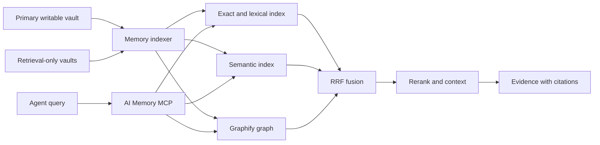

# Architecture

## Decision

AI Memory MCP uses Graphify as an internal graph provider.
The system does not expose Graphify as its permanent public interface.

Agents use the stable AI Memory MCP tools.
The MCP server owns scope, ranking, freshness, evidence, health, and refresh control.

## Source authority

Markdown files in all configured vaults are source data.
The primary vault is the only write authority.
Additional vaults are retrieval-only sources.
The system can rebuild all indexes from the Markdown files.

The system derives the SQLite index and Graphify graph from Markdown.
A failed refresh does not change the Markdown authority.

## System flow

## Components

### Markdown memory

The configured primary vault receives all new records.
Named additional vaults supply retrieval-only records.
Each durable record has an identity, scope, status, dates, and provenance.

### Memory indexer

The indexer reads changed Markdown files from all configured vaults.
It validates identity and metadata.
It skips unchanged content.
It publishes a versioned SQLite snapshot.
It prefixes each indexed path with its source ID.
It does not modify a configured vault.

### Exact and lexical retrieval

SQLite FTS5 supplies exact and lexical results.
Exact matches get priority for identifiers, paths, filenames, and error text.

### Semantic retrieval

Deterministic semantic vectors supply paraphrase results.
The semantic index stays local and does not need an external API.

### Graphify provider

Graphify supplies graph nodes, edges, neighbors, and paths.
The repository pins Graphify 0.9.26 in an isolated environment.

The routine refresh builds a Graphify-compatible graph from the current SQLite index.
This build covers all configured memory sources without an extraction API.

The graph contains one node for each indexed document.
The graph also contains declared relationships and shared-scope relationships.

Semantic Graphify extraction remains an optional maintenance operation.
It does not control routine memory availability.

The provider adapter hides Graphify file formats from MCP clients.
The adapter keeps Graphify replaceable.

### MCP facade

The MCP facade gives agents three public tools.
The facade applies scope rules before retrieval.
The facade returns source paths and retrieval evidence.

## Query procedure

1. Resolve the optional source and domain scope.
2. Apply repository, project, ticket, status, and path filters.
3. Select the required retrieval providers.
4. Run the selected providers.
5. Fuse ranked results with reciprocal rank fusion.
6. Remove duplicate memory results.
7. Rerank a bounded result set.
8. Add the necessary context.
9. Return evidence with source paths.

Graph traversal is one retrieval signal.
Graph traversal is not the only retrieval method.

## Refresh procedure

1. Validate all configured memory sources.
2. Update the SQLite index.
3. Build the Graphify provider graph from the index.
4. Validate the staged graph.
5. Publish the staged graph atomically.
6. Reload the Graphify service.
7. Run a retrieval health check.

The update keeps the last satisfactory data after a failure.
An ordinary Markdown change uses `memory_sync`.
The maintenance script records each phase in a local JSONL log.

## Provider boundary

The MCP contract must not depend on Graphify response formats.
The graph provider can change without an MCP tool change.

Replace Graphify only if its adapter cannot meet a required contract.
Examples include unsafe updates, unstable serialization, or insufficient provenance.

## Performance rules

- Apply scope filters before ranking.
- Use exact matches for stable identifiers.
- Use reciprocal rank fusion for provider results.
- Limit reranking to a bounded candidate set.
- Load context for all results in one database query.
- Keep normal recall responses compact.
- Process only changed Markdown files during normal refreshes.
- Keep full graph clustering as a maintenance task.
- Skip snapshot publication when no Markdown file changed.
- Store semantic vectors in a compact binary form.
- Combine adjacent short sections before indexing chat exports.
- Load Graphify candidate documents in one index query.

## Reliability rules

- Pin one Graphify version.
- Keep the CLI, library, MCP server, and health data consistent.
- Validate staged data before publication.
- Preserve the last satisfactory graph.
- Record Markdown and index results separately.
- Return source paths for evidence.
- Do not remove recovery files without authorization.

## Public tools

| Tool | Function |
|---|---|
| `memory_recall` | Returns cited evidence and applicable relationships. |
| `memory_sync` | Updates the derived index from canonical Markdown. |
| `memory_status` | Reports source, index, Graphify, and runtime status. |

`memory_recall` selects its internal behavior from the query.
An exact identity returns the complete record.
A relationship question returns a graph path when a path exists.
A general question runs lexical, semantic, and graph retrieval.

The MCP does not expose provider diagnostics in normal recall results.
The MCP does not expose full Graphify rebuilds.
Use the Graphify maintenance script for a full rebuild.

Each recall result contains `status`, `intent`, `evidence`, `citations`, `relationships`, and `warnings`.

## Research sources

- [Cerebras knowledge base design](https://www.cerebras.ai/blog/how-we-built-our-knowledge-base)
- [Anthropic contextual retrieval](https://www.anthropic.com/engineering/contextual-retrieval)
- [Microsoft GraphRAG query modes](https://microsoft.github.io/graphrag/query/overview/)
- [Graphify releases](https://github.com/Graphify-Labs/graphify/releases)
