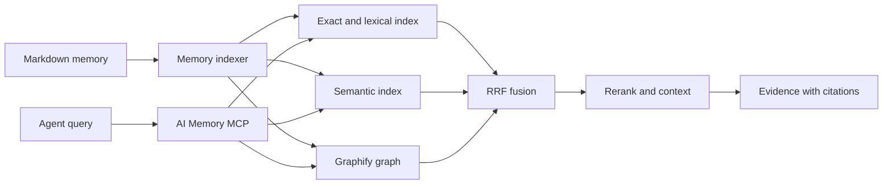

# Architecture

## Decision

AI Memory MCP uses Graphify as an internal graph provider.
The system does not expose Graphify as its permanent public interface.

Agents use the stable AI Memory MCP tools.
The MCP server owns scope, ranking, freshness, evidence, health, and refresh control.

## Source authority

Markdown files are the source of truth.
The system can rebuild all indexes from the Markdown files.

The system derives the SQLite index and Graphify graph from Markdown.
A failed refresh does not change the Markdown authority.

## System flow

## Components

### Markdown memory

The configured memory directory contains the canonical records.
Each durable record has an identity, scope, status, dates, and provenance.

### Memory indexer

The indexer reads changed Markdown files.
It validates identity and metadata.
It skips unchanged content.
It publishes a versioned SQLite snapshot.

### Exact and lexical retrieval

SQLite FTS5 supplies exact and lexical results.
Exact matches get priority for identifiers, paths, filenames, and error text.

### Semantic retrieval

Deterministic semantic vectors supply paraphrase results.
The semantic index stays local and does not need an external API.

### Graphify provider

Graphify supplies graph nodes, edges, neighbors, and paths.
The repository pins Graphify 0.9.26 in an isolated environment.

The provider adapter hides Graphify file formats from MCP clients.
The adapter keeps Graphify replaceable.

### MCP facade

The MCP facade gives agents eight public tools.
The facade applies authorization and scope rules before retrieval.
The facade returns source paths and retrieval evidence.

## Query procedure

1. Resolve the work or personal scope.
2. Apply repository, project, ticket, status, and path filters.
3. Select the required retrieval providers.
4. Run the selected providers.
5. Fuse ranked results with reciprocal rank fusion.
6. Remove duplicate memory results.
7. Rerank a bounded result set.
8. Add the necessary context.
9. Return evidence with source paths.

Graph traversal is one retrieval signal.
Graph traversal is not the only retrieval method.

## Refresh procedure

1. Validate the canonical memory root.
2. Detect changed Markdown files.
3. Build derived data in a staging location.
4. Validate the staged data.
5. Publish the staged data atomically.
6. Reload the applicable service.
7. Run a retrieval health check.

The refresh keeps the last satisfactory data after a failure.
An ordinary Markdown change uses an index refresh.
A full refresh also updates the Graphify graph.

## Provider boundary

The MCP contract must not depend on Graphify response formats.
The graph provider can change without an MCP tool change.

Replace Graphify only if its adapter cannot meet a required contract.
Examples include unsafe updates, unstable serialization, or insufficient provenance.

## Performance rules

- Apply scope filters before ranking.
- Use exact matches for stable identifiers.
- Run independent retrieval providers concurrently when possible.
- Use reciprocal rank fusion for provider results.
- Limit reranking to a bounded candidate set.
- Process only changed Markdown files during normal refreshes.
- Keep full graph clustering as a maintenance task.

## Reliability rules

- Pin one Graphify version.
- Keep the CLI, library, MCP server, and health data consistent.
- Validate staged data before publication.
- Preserve the last satisfactory graph.
- Record Markdown and index results separately.
- Return source paths for evidence.
- Do not remove recovery files without authorization.

## Public tools

| Tool | Function |
|---|---|
| `memory_search` | Finds memory evidence. |
| `memory_get` | Gets one canonical record. |
| `memory_neighbors` | Gets related records. |
| `memory_path` | Finds a graph path. |
| `memory_explain` | Explains a retrieval result. |
| `memory_refresh` | Updates derived data. |
| `memory_health` | Gives system health data. |
| `memory_feedback` | Records result feedback. |

## Research sources

- [Cerebras knowledge base design](https://www.cerebras.ai/blog/how-we-built-our-knowledge-base)
- [Anthropic contextual retrieval](https://www.anthropic.com/engineering/contextual-retrieval)
- [Microsoft GraphRAG query modes](https://microsoft.github.io/graphrag/query/overview/)
- [Graphify releases](https://github.com/Graphify-Labs/graphify/releases)
