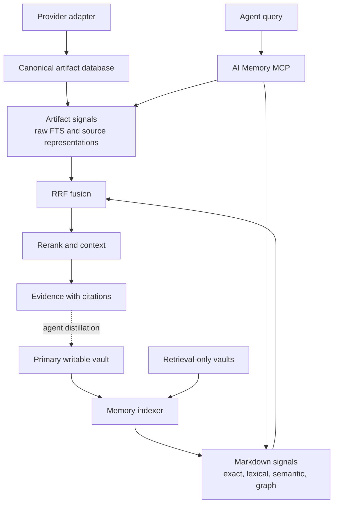

# Architecture

The [retrieval reliability design](retrieval-reliability-design.md) defines complex-query, historical-message, meeting, and large-collection behavior.
The [implementation plan](retrieval-reliability-implementation-plan.md) records the reliability work and remaining evaluation.
This work excludes sentence-derived criterion filtering.

## Decision

AI Memory MCP builds its note graph natively in each retrieval generation.
AI Memory does not use the external Graphify package.
The [archived Graphify memory pipeline](../archive/graphify-memory-pipeline/README.md) records the earlier design.

The Graphify Codebase skill in `graphify-codebase/` is independent from AI Memory.
That skill does not supply data to AI Memory retrieval.

Agents use the stable AI Memory MCP tools.
The MCP server owns scope, ranking, freshness, evidence, health, and refresh control.

## Source authority

Markdown files in all configured vaults are durable-memory source data.
The primary vault is the only Markdown write authority.
Additional vaults are retrieval-only sources.
The canonical artifact database is the write authority for raw external artifacts.

The system derives memory indexes from Markdown.
The system derives artifact search and semantic representation indexes from the canonical artifact database.

Raw artifacts never make a Markdown file authoritative for a transcript or chat log.
Distilled Markdown never makes the artifact database authoritative for an agent summary.

A failed refresh does not change either authority.

## Internal data layout

`AI_MEMORY_WORK_DIR` is the single configured root for Markdown and internal data.
AI Memory stores implementation data in the hidden `.ai-memory` directory.

```text
AI_MEMORY_WORK_DIR/
├── <Markdown memory directories>
└── .ai-memory/
    ├── raw/
    │   ├── artifacts.sqlite3
    │   └── objects/
    ├── backups/
    ├── migration/
    ├── provider-state/
    ├── indexes/
    └── logs/
```

The indexer excludes hidden directories from Markdown discovery.
Explicit environment overrides remain available for existing and advanced installations.

## System flow


```mermaid
flowchart TB
    C["Provider adapter"] --> D["Canonical artifact database"]
    P["Primary writable vault"] --> I["Memory indexer"]
    A["Retrieval-only vaults"] --> I
    I --> MdSignals["Markdown signals<br/>exact, lexical, semantic, graph"]
    D --> ArtSignals["Artifact signals<br/>raw FTS and source representations"]
    Q["Agent query"] --> S["AI Memory MCP"]
    S --> MdSignals
    S --> ArtSignals
    MdSignals --> F["RRF fusion"]
    ArtSignals --> F
    F --> R["Rerank and context"]
    R --> E["Evidence with citations"]
    E -. agent distillation .-> P
```

Each signal group supplies its own ranked view.
Fusion combines those views, and no group receives a rank penalty from list order.

## Components

### Markdown memory

The configured primary vault receives all new records.
Named additional vaults supply retrieval-only records.
Each durable record has an identity, domain, record type, status, dates, and provenance.
Optional collections provide typed Obsidian Bases views.
The folder path does not define record meaning.

### Memory indexer

The indexer reads changed Markdown files from all configured vaults.
It validates identity and metadata.
It skips unchanged content.
It publishes a versioned SQLite snapshot.
It prefixes each indexed path with its source ID.
It creates compact aliases for memory identities and scopes.
It does not modify a configured vault.
It updates vectors only for changed Markdown chunks.
Large vector searches use an ANN candidate index before exact reranking.
Portable installations use exact search when the ANN backend is unavailable.

Artifact vector schema `7` adds a compact covering index to each immutable segment.
Candidate counts and compact-vector scans use this index without reading full vectors or source text.
The index includes scope fields and source identities for segment visibility checks.
The next successful synchronization rebuilds incompatible derived vector indexes.
Canonical Markdown and artifact records do not change.

### Exact and lexical retrieval

SQLite FTS5 supplies exact and lexical results.
Exact matches get priority for identifiers, paths, filenames, and error text.
Repository filters accept the canonical ID, owner and repository, repository name, or encoded folder name.
Narrow scopes can combine independently corroborated evidence from multiple notes.

### Semantic retrieval

A local embedding provider supplies paraphrase results.
The default provider is Model2Vec with the `minishlab/potion-base-8M` model.
The hashed feature provider is the automatic fallback.
The semantic index stays local and does not need an external API.

The index records the embedding provider that built it.
A query always uses the recorded provider.
A provider change makes the indexer build all vectors again.
If the recorded provider is not available, recall disables the semantic signal and gives a warning.

Each nonempty message and transcript passage gets a base representation.
Long source text uses overlapping segments that cover the complete text.
Timestamp-free transcript passages use provider order or stable source order.
Reply-aware representations include the explicit reply target before nearby messages.
Each result still cites its canonical anchor record.

### Note graph

The note graph supplies graph nodes, edges, neighbors, and paths.
`src/ai_memory_mcp/graph_builder.py` builds the graph with `build_memory_graph`.
`src/ai_memory_mcp/memory_graph.py` uses `MemoryGraph` to rank notes, find neighbors, and find paths.

Each `memory_sync` builds the graph from the Markdown index snapshot of the same generation.
The build covers all configured memory sources.
The build does not use an external tool or an external API.

The graph contains one node for each indexed note.
The graph also contains one scope node for each `scope_kind` and `scope_id` pair.

The graph build makes an edge from three sources.
A generic scope value makes a `belongs-to` edge.
A frontmatter `related` entry makes a `declared-related` edge.
A body wikilink makes a `body-link` edge.
The build does not add a `body-link` edge when a `declared-related` edge already connects the two notes.
For body links, the build reports unresolved and ambiguous counts separately.
For `related` entries, one count includes unresolved and ambiguous targets.

Each edge has the `DECLARED` confidence.
The graph does not contain inferred or semantic relationships.

#### Link parsing

The wikilink parser ignores fenced code blocks, inline code, HTML comments, and Obsidian `%% %%` comments.
The parser uses the CommonMark fence rules for fenced code blocks.
The parser reads a `[[Note\|Label]]` link in a table.
The parser ignores an escaped `\[[...]]` link.
A link cannot continue across two lines.
Intake link validation uses the same parser.

A `related` entry can be a quoted `"[[Note]]"` link.
A `related` entry can also be an unquoted `- [[Note]]` YAML item.
YAML reads the unquoted item as a nested list, and the parser changes it back into a link.
One `related` entry can contain more than one link.
A `related` entry can also be a plain note name.

A frontmatter fence must be a complete line.
A `---` line opens the frontmatter.
A `---` line or a `...` line closes the frontmatter.

#### Snapshot format

The graph snapshot uses NetworkX node-link JSON with `nodes` and `links` keys.
The reader also accepts the older `edges` key.
The metadata contains `provider: "ai-memory"`, `format: "ai-memory-graph@1"`, and `build_mode: "deterministic-memory-index"`.
The metadata also contains `index_snapshot`, `built_at`, and `memory_sources`.

`parse_graph_snapshot` validates each snapshot before traversal.
The function rejects a payload that is not a JSON object or that has no node list.
The function rejects a node without an identifier and a duplicate node identifier.
The function rejects an edge without two endpoints and an edge to a missing node.
Each rejection raises `GraphSnapshotError`, which is a `ValueError`.

`memory_status` reports a malformed graph as unavailable and gives the cause in `graph.error`.
Recall keeps the lexical and semantic results and gives a warning.

#### Traversal

Graph ranking starts from seed notes.
Label-token overlap with the query selects seed notes.
The lexical and semantic results also supply seed notes.
A bounded best-first expansion then follows the edges from each seed note.
`AI_MEMORY_MCP_GRAPH_DEPTH` sets the expansion depth, with a default of 2 and a maximum of 4.
Each step multiplies the score by the edge confidence weight and by a 0.45 decay.

Neighbor lookup uses breadth-first search.
Path lookup uses breadth-first search with a maximum depth of 6.

Graph traversal applies all requested scopes before it follows an edge.
Traversal never visits a note node outside the allowed paths, and never uses that node as an intermediate node.
A scope node has no source note, so a scope node can connect two allowed notes.
Weighted traversal permits controlled multi-hop evidence inside that scope.
The MCP tools do not expose the graph snapshot format.

### MCP facade

The MCP facade gives agents five public tools.
The facade applies scope rules before retrieval.
The facade returns source paths and retrieval evidence.
The facade runs recall in a bounded pool of supervised worker processes.
Each worker keeps immutable generation data and local models warm.
Queue time is part of the recall deadline.
The facade rejects work when the bounded queue is full.
The facade stops and reaps the worker when the recall deadline expires.
The facade also stops the assigned worker after client cancellation.
Process termination closes the worker generation lease and SQLite snapshot.

| Tool | Function |
|---|---|
| `memory_recall` | Returns cited Markdown and artifact evidence. |
| `memory_artifact_read` | Returns ordered raw context for one artifact reference. |
| `memory_upsert` | Creates or updates one validated schema-version-2 record. |
| `memory_sync` | Publishes one coordinated derived generation. |
| `memory_status` | Reports strict health for each required layer. |

`memory_status` marks the index as stale when canonical Markdown differs from the published snapshot.
`memory_status` reports the note graph in the `graph` field.
The graph is stale when it does not match the published generation or the current Markdown index snapshot.

## Query procedure

1. Pin one current generation manifest.
2. Open one artifact database read snapshot.
3. Resolve each explicit source, domain, collection, record type, and generic scope.
4. Apply each explicit scope filter.
5. Send the complete query to each applicable provider.
6. Fuse provider ranks with reciprocal rank fusion.
7. Remove duplicate source identities.
8. Preserve the winning passage and offsets.
9. Add bounded context after ranking.
10. Return evidence, citations, coverage, and execution state.

Graph traversal is one retrieval signal.
Graph traversal is not the only retrieval method.

Fusion adds a bounded freshness bonus from the `updated` date.
An expired `review_after` date applies a bounded penalty and adds a `review overdue` reason.
Raw artifacts do not receive an age penalty.
The service does not infer ticket, person, date, decision, or exclusion filters from a sentence.

## Refresh procedure

1. Validate all configured memory sources.
2. Stage the Markdown vector snapshot.
3. Read artifact changes from the committed journal.
4. Rebuild changed source segments and bounded dependent context.
5. Build the note graph from the staged Markdown snapshot.
6. Validate all staged components.
7. Publish one generation manifest atomically.
8. Record the generation health.
9. Retain the active and verified previous generations.

Before the pointer changes, publication validates the graph structure and the Markdown snapshot name.
The manifest records the graph sha256 checksum, byte count, node count, and edge count.
Retention compares each retained graph with these recorded values.
The manifest and health files name the layers `markdown`, `artifact_vector`, and `graph`.
Older generations name the graph layer `graphify`, and readers accept both names.

The update keeps the previous generation after any component failure.
The `memory_sync` MCP tool and the `ai-memory-sync` console command run this procedure.
An ordinary Markdown change uses `memory_sync`.
An artifact data change also uses `memory_sync`.
Each recall keeps one generation lease until retrieval finishes.
Retention removes only derived snapshots that no active lease uses.

## Provider boundary

The MCP contract must not depend on the graph snapshot format.
The note graph can change without an MCP tool change.

The note graph does not need an external graph engine.
The setup procedure installs the pinned Graphify runtime only with `--with-graphify-codebase`.
Only the independent Graphify Codebase skill uses that runtime.
`scripts/retire_graphify_memory.py` retires the earlier Graphify listener, launcher, and state on an upgraded installation.

## Performance rules

- Apply scope filters before ranking.
- Resolve scope aliases through indexed lookup tables.
- Use exact matches for stable identifiers.
- Use indexed identity lookups before hybrid retrieval.
- Use reciprocal rank fusion for provider results.
- Limit reranking to a bounded candidate set.
- Load context for all results in one database query.
- Keep normal recall responses compact.
- Process only changed Markdown files during normal refreshes.
- Build the note graph from the indexed Markdown snapshot, not from the Markdown files.
- Update only changed Markdown chunks and affected artifact representations.
- Use ANN candidates before exact vector reranking for large corpora.
- Use exact vector search when ANN support is unavailable.
- Store semantic vectors in a compact binary form.
- Combine adjacent short sections before indexing chat exports.
- Load graph candidate documents in one index query.

## Reliability rules

- Validate each graph snapshot before traversal.
- Pin every recall to one coordinated generation.
- Keep one artifact database read snapshot for each recall.
- Keep the CLI, library, MCP server, and health data consistent.
- Validate staged data before publication.
- Preserve the last satisfactory generation.
- Report health and freshness for every required layer.
- Record privacy-safe latency, corpus, storage, growth, and failure metrics.
- Return source paths for evidence.
- Remove only derived snapshots through the approved retention process.
- Stop and reap a recall worker when its deadline expires.

## Public tools

| Tool | Function |
|---|---|
| `memory_recall` | Returns cited evidence and applicable relationships. |
| `memory_artifact_read` | Returns ordered raw context for one artifact reference. |
| `memory_sync` | Publishes one coordinated generation after canonical data changes. |
| `memory_status` | Reports strict health for each required layer and generation. |

`memory_recall` selects retrieval providers from the query and explicit scope arguments.
An exact identity returns the complete record.
A relationship question returns a graph path when a path exists.
A general question runs lexical, semantic, and graph retrieval.

Response version 2 reports execution and result kind separately.
The result kind is `exact`, `ranked`, or `empty`.
Execution is `complete`, `partial`, or `failed`.
Coverage reports source availability, semantic lag, processing counts, and observed date bounds.
In response version 1, a paraphrase answer needs a lexical anchor and a semantic margin above the other results.
The two conditions together keep an absent answer at `no_answer`.

A `no_answer` status still returns ranked best-effort evidence.
A warning marks that evidence as leads that require verification.

The MCP does not expose provider diagnostics in normal recall results.
Each `memory_sync` rebuilds the complete note graph.
The note graph does not need a separate maintenance rebuild.

Each recall result contains `status`, `intent`, `evidence`, `citations`, `relationships`, and `warnings`.

## Research sources

- [Cerebras knowledge base design](https://www.cerebras.ai/blog/how-we-built-our-knowledge-base)
- [Anthropic contextual retrieval](https://www.anthropic.com/engineering/contextual-retrieval)
- [Microsoft GraphRAG query modes](https://microsoft.github.io/graphrag/query/overview/)
