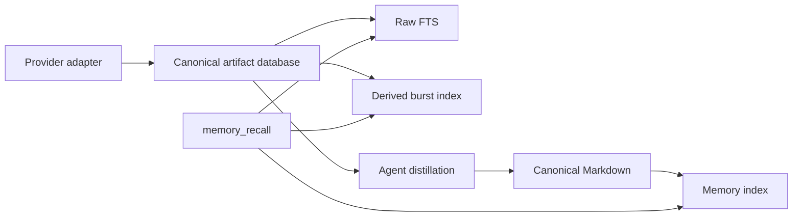

# Chat and Meeting Artifact Store Implementation Plan

> **For agentic workers:** REQUIRED SUB-SKILL: Use superpowers:subagent-driven-development (recommended) or superpowers:executing-plans to implement this plan task-by-task. Steps use checkbox (`- [ ]`) syntax for tracking.

**Goal:** Add generic chat and meeting intake to AI Memory. Keep raw artifacts in canonical SQLite and distilled knowledge in canonical Markdown.

**Architecture:** A provider emits versioned JSONL batches.
AI Memory validates each batch and stores each source artifact as one SQLite record.
The MCP service searches raw artifacts and distilled Markdown together.
Agents write concise meeting and conversation summaries to Markdown with artifact citations.

**Tech Stack:** Python 3.11+, SQLite WAL and FTS5, Pydantic v2, pytest, Markdown, TypeScript producer adapters.

---

## Approved decisions

- SQLite is the canonical store for raw chats, meetings, transcripts, revisions, and tombstones.
- Markdown is the canonical store for summaries, decisions, actions, resolutions, and durable facts.
- A meeting gets one distilled Markdown note.
- A conversation gets a Markdown note only when it contains durable knowledge.
- A Markdown note contains short quotations and artifact links. It does not contain a full transcript.
- An agent updates only the managed distillation region. Manual Markdown stays outside that region.
- An agent can read the complete source through `memory_artifact_read` when more context is necessary.
- The provider adapter owns authentication, paging, remote cursors, and reconciliation decisions.
- AI Memory owns validation, identity, storage, revisions, search, receipts, and citations.
- The server does not call an LLM. An agent performs distillation.
- Attachment files stay outside SQLite. SQLite stores their hashes, metadata, and object paths.
- The canonical artifact database stays separate from the derived Markdown index.
- Store one record for each message or transcript cue. Do not store an unbounded conversation array.
- Store JSON as canonical UTF-8 text. Do not require SQLite JSONB in the first release.
- The Markdown intake contract applies only to durable Markdown. The artifact batch contract is separate.
- This plan replaces the raw-chat Markdown design in the earlier messages-and-meetings plan.

## Delivery stages

This plan has two coupled stages.

1. Build and verify the AI Memory artifact contract and store.
2. Change the current provider adapter to emit that contract.

Stage 1 produces a complete synthetic end-to-end flow. Stage 2 connects the live provider after migration verification.

## Repository boundaries

AI Memory paths are relative to the `ai-memory-mcp` repository.

Provider paths are relative to the `teams-cli` repository. That repository keeps all provider-specific code.

Do not copy provider credentials, tenant values, private URLs, or live records into either repository.

## File map

### AI Memory source files

| File | Responsibility |
|---|---|
| `src/ai_memory_mcp/artifacts/models.py` | Defines strict batch, event, payload, receipt, search, and read models. |
| `src/ai_memory_mcp/artifacts/identity.py` | Creates stable artifact IDs, event IDs, digests, and artifact URIs. |
| `src/ai_memory_mcp/artifacts/schema.py` | Opens the canonical database and applies ordered migrations. |
| `src/ai_memory_mcp/artifacts/store.py` | Applies events and materializes current artifact state. |
| `src/ai_memory_mcp/artifacts/ingest.py` | Reads complete JSONL batches and returns receipts. |
| `src/ai_memory_mcp/artifacts/search.py` | Runs scoped FTS and ordered context reads. |
| `src/ai_memory_mcp/artifacts/distillation.py` | Tracks pending and completed distillation state. |
| `src/ai_memory_mcp/artifacts/objects.py` | Copies verified attachment objects into content-addressed storage. |
| `src/ai_memory_mcp/artifacts/vector_index.py` | Publishes the derived burst-vector snapshot. |
| `src/ai_memory_mcp/artifacts/backup.py` | Creates consistent backups and runs integrity checks. |
| `src/ai_memory_mcp/artifacts/cli.py` | Exposes ingest, search, read, pending, backup, and migration commands. |
| `src/ai_memory_mcp/artifacts/migrate_legacy.py` | Imports legacy SQLite and Markdown without changing the sources. |
| `src/ai_memory_mcp/config.py` | Adds local artifact database, object, and backup paths. |
| `src/ai_memory_mcp/models.py` | Adds artifact evidence, citations, status, and scope fields. |
| `src/ai_memory_mcp/retrieval.py` | Fuses distilled, raw, and burst evidence. |
| `src/ai_memory_mcp/service.py` | Orchestrates recall, artifact reads, status, and safe audit data. |
| `src/ai_memory_mcp/server.py` | Exposes the additive `memory_artifact_read` tool and filters. |

### AI Memory tests

| File | Responsibility |
|---|---|
| `tests/test_artifact_identity.py` | Tests collision-safe IDs and URI parsing. |
| `tests/test_artifact_schema.py` | Tests migrations, constraints, WAL, and FTS. |
| `tests/test_artifact_ingest.py` | Tests idempotence, revisions, tombstones, conflicts, and receipts. |
| `tests/test_artifact_objects.py` | Tests hashes, atomic copies, and safe object paths. |
| `tests/test_artifact_search.py` | Tests scope, FTS, ordering, and pagination. |
| `tests/test_artifact_distillation.py` | Tests pending state and Markdown completion checks. |
| `tests/test_artifact_retrieval.py` | Tests fusion, evidence classes, answer gates, and citations. |
| `tests/test_artifact_backup.py` | Tests consistent backup and recovery. |
| `tests/test_artifact_migration.py` | Tests legacy import and repeated no-op runs. |
| `tests/test_artifact_e2e.py` | Tests batch-to-recall-to-distillation behavior. |

### Provider files

| File | Responsibility |
|---|---|
| `src/teams/core/artifact-envelope.ts` | Maps provider records to the generic artifact contract. |
| `src/teams/core/artifact-batch.ts` | Writes complete JSONL batches atomically. |
| `src/teams/messages-sync.ts` | Fetches messages, retains cursor logic, and emits artifact events. |
| `src/teams/transcripts-sync.ts` | Fetches transcript cues and emits meeting artifact events. |
| `src/teams/sync/db.ts` | Retains provider fetch state and reconciliation coverage. |
| `tests/artifact-envelope.test.ts` | Tests neutral envelope mapping and deterministic IDs. |
| `tests/artifact-batch.test.ts` | Tests batch counts, coverage claims, and replay output. |

## Global constraints

- Read `AGENTS.md` before each implementation task.
- Read `docs/writing-standard.md` before each documentation task.
- Use ASD-STE100 Simplified Technical English in changed documentation.
- Use neutral synthetic records in all tests and examples.
- Do not put an absolute user path in a tracked file.
- Do not change the three existing user-owned modified files during plan execution without explicit scope.
- Do not delete a source file, database, note, backup, or migration input.
- Put machine-specific configuration in the ignored `.env` file.
- Keep the active artifact database on a local filesystem.
- Never open the active SQLite database across a network filesystem.
- Keep the existing Markdown-derived index immutable and replaceable.
- Keep Graphify independent from artifact storage.
- Do not add source-specific behavior to the AI Memory artifact package.
- Do not make a raw artifact an authoritative durable answer without exact evidence.
- Preserve manual Markdown content during each summary update.
- Do not write a full transcript or complete chat log to Markdown.
- Do not store credentials, cookies, access tokens, signed URLs, or temporary download URLs in an artifact payload.
- Restrict canonical database, object, and backup paths to the local operating-system account.
- Keep the frozen Markdown retrieval benchmark unchanged.
- Run privacy tests before each commit.
- Inspect each staged diff before each commit.

---

### Task 0: Prepare isolated implementation worktrees

**Files:** None.

**Interfaces:**

- Produces one clean AI Memory worktree from the approved base commit.
- Produces one clean provider worktree from the authoritative provider repository.
- Preserves all current uncommitted changes in their original checkout.

- [ ] **Step 1: Record the current AI Memory state**

Run:

```bash
git branch --show-current
git status --short
git rev-parse HEAD
```

Expected: record the branch, commit, and all user-owned changes.
Do not stage, stash, revert, or commit those changes.

- [ ] **Step 2: Resolve the README overlap**

The current checkout has a user-owned `README.md` change.
Task 1 also changes `README.md`.

Before Task 1, use a base branch that includes the user change or get an explicit conflict decision.
Do not overwrite the current file from an isolated worktree.

- [ ] **Step 3: Create the AI Memory worktree**

Use `superpowers:using-git-worktrees`.
Create a new `codex/` branch from the approved base commit.

Run the frozen tests before changing a file:

```bash
.venv/bin/python -m pytest -q
```

Expected: all existing tests pass.

- [ ] **Step 4: Find the authoritative provider checkout**

The reviewed provider directory is a source copy without Git metadata.
Do not initialize Git inside that copy.

Locate the authoritative Git checkout before Task 13.
If no authoritative checkout exists, stop Task 13 and report that repository-state decision.
Tasks 1 through 12 can continue independently.

- [ ] **Step 5: Create the provider worktree**

Use `superpowers:using-git-worktrees` in the authoritative provider checkout.
Create a new `codex/` branch from its approved base commit.

Run the provider test commands from Task 13 before changing a file.
Expected: all existing provider tests pass.

---

### Task 1: Document the dual-authority architecture

**Files:**

- Create: `docs/artifact-storage.md`
- Modify: `docs/architecture.md`
- Modify: `docs/README.md`
- Modify: `README.md`

**Interfaces:**

- Produces the terms `canonical artifact database`, `canonical Markdown`, `distilled`, `raw`, and `burst`.
- Defines `artifact://<entity>/<artifact-id>` as the stable raw citation format.
- Makes the existing intake-contract plan independent from raw artifact intake.

- [ ] **Step 1: Read the documentation standard**

Read `docs/writing-standard.md` completely.

- [ ] **Step 2: Write the artifact storage guide**

Create `docs/artifact-storage.md` with these sections:

```markdown
# Artifact Storage

## Authority

SQLite is the authority for raw external artifacts.
Markdown is the authority for distilled durable knowledge.

The two stores contain related information, but they do not have the same role.
The system can rebuild artifact search data from the canonical artifact database.
The system can rebuild memory search data from canonical Markdown.

## Raw artifacts

The canonical artifact database stores conversations, messages, meetings, recordings, transcripts, transcript cues, attachments, revisions, and tombstones.

Each message and transcript cue is one record.
The database does not store a complete conversation as one array.

## Distilled Markdown

A meeting note contains a summary, decisions, actions, open questions, and short evidence quotations.
A conversation note contains durable resolutions, decisions, and reusable context.

A distilled note links each important claim to an `artifact://` citation.
A distilled note does not contain a complete transcript or chat log.

## Provider boundary

The provider adapter owns authentication, paging, remote cursors, and complete-snapshot claims.
AI Memory owns validation, canonical storage, revisions, receipts, search, and citations.

## Retrieval

`memory_recall` searches distilled Markdown and raw artifact text.
Distilled evidence can answer a general question.
Raw evidence is a lead unless the query has an exact match.

Use `memory_artifact_read` to read ordered source context around an artifact citation.

## Attachment files

Attachment files stay in content-addressed object storage.
SQLite stores each object hash, media type, size, and relative object path.

## Recovery

Create a consistent SQLite backup before each schema migration.
Keep the migration source unchanged until count and digest checks pass.
```

- [ ] **Step 3: Amend the architecture authority section**

Replace the single-authority statement with two explicit data classes.

Use this text in `docs/architecture.md`:

```markdown
Markdown is the write authority for durable memory.
The canonical artifact database is the write authority for raw external artifacts.

The system derives memory indexes from Markdown.
The system derives artifact search and burst indexes from the canonical artifact database.

Raw artifacts never make a Markdown file authoritative for a transcript or chat log.
Distilled Markdown never makes the artifact database authoritative for an agent summary.
```

Update the architecture diagrams with these flows:



- [ ] **Step 4: Update navigation and the root summary**

Add `Artifact storage` to `docs/README.md`.

Update the root architecture summary. State both canonical data classes.

- [ ] **Step 5: Verify the documentation**

Run:

```bash
rg -n "canonical artifact database|memory_artifact_read|full transcript" docs/artifact-storage.md docs/architecture.md README.md
```

Expected: each concept occurs in the artifact guide and architecture guide.

Run:

```bash
.venv/bin/python -m pytest tests/test_portability.py -q
```

Expected: all tests pass.

- [ ] **Step 6: Commit Task 1**

```bash
git add docs/artifact-storage.md docs/architecture.md docs/README.md README.md
git diff --cached
git commit -m "docs: define artifact and Markdown authority"
```

---

### Task 2: Add artifact configuration and stable identity

**Files:**

- Create: `src/ai_memory_mcp/artifacts/__init__.py`
- Create: `src/ai_memory_mcp/artifacts/identity.py`
- Create: `src/ai_memory_mcp/artifacts/models.py`
- Create: `tests/test_artifact_identity.py`
- Modify: `src/ai_memory_mcp/config.py`
- Modify: `.env.example`
- Modify: `docs/configuration.md`

**Interfaces:**

- `artifact_id(source, source_instance, entity, external_id) -> str`
- `event_id(source, source_instance, event) -> str`
- `artifact_uri(entity, artifact_id) -> str`
- `parse_artifact_uri(value) -> tuple[str, str]`
- `Settings.artifact_db: Path`
- `Settings.artifact_objects_dir: Path`
- `Settings.artifact_backup_dir: Path`
- `Settings.artifact_batch_max_bytes: int`

- [ ] **Step 1: Write failing identity tests**

Create `tests/test_artifact_identity.py`:

```python
from ai_memory_mcp.artifacts.identity import (
    artifact_id,
    artifact_uri,
    parse_artifact_uri,
)


def test_artifact_id_includes_source_instance_and_entity() -> None:
    first = artifact_id("teams", "work", "message", "message-17")
    assert first == artifact_id("teams", "work", "message", "message-17")
    assert first != artifact_id("teams", "personal", "message", "message-17")
    assert first != artifact_id("teams", "work", "meeting", "message-17")
    assert first.startswith("art_")


def test_artifact_uri_does_not_expose_external_id() -> None:
    value = artifact_id("teams", "work", "message", "unsafe/../value")
    uri = artifact_uri("message", value)
    assert uri == f"artifact://message/{value}"
    assert "unsafe" not in uri
    assert parse_artifact_uri(uri) == ("message", value)
```

- [ ] **Step 2: Run the identity tests**

Run:

```bash
.venv/bin/python -m pytest tests/test_artifact_identity.py -v
```

Expected: collection fails because the artifact package does not exist.

- [ ] **Step 3: Implement stable IDs and URIs**

Use SHA-256 over null-separated UTF-8 identity fields.
Encode the first 160 digest bits with lowercase base32.

Use these constants and signatures:

```python
SOURCE_PATTERN = re.compile(r"^[a-z][a-z0-9-]{0,62}$")
INSTANCE_PATTERN = re.compile(r"^[a-z][a-z0-9-]{0,62}$")
ENTITY_PATTERN = re.compile(r"^[a-z][a-z0-9-]{0,62}$")
ARTIFACT_ID_PATTERN = re.compile(r"^art_[a-z2-7]{32}$")
EVENT_ID_PATTERN = re.compile(r"^evt_[a-z2-7]{32}$")
BATCH_ID_PATTERN = re.compile(r"^[A-Za-z0-9][A-Za-z0-9._:-]{0,127}$")


def artifact_id(
    source: str,
    source_instance: str,
    entity: str,
    external_id: str,
) -> str:
    parts = (source, source_instance, entity, external_id)
    payload = "\0".join(parts).encode("utf-8")
    encoded = base64.b32encode(hashlib.sha256(payload).digest()[:20])
    return "art_" + encoded.decode("ascii").rstrip("=").lower()
```

Reject an empty external ID.
Reject an external ID longer than 2048 characters.
Never use an external ID as a filename.

Use the same digest encoding for event IDs.
Use the `evt_` prefix for an event ID.

- [ ] **Step 4: Define strict batch and event models**

Add these model names in `artifacts/models.py`:

```python
ArtifactEntity = Literal[
    "conversation",
    "message",
    "meeting",
    "recording",
    "transcript",
    "transcript-cue",
    "attachment",
]
ArtifactOperation = Literal["upsert", "delete", "redact"]
ArtifactEvidenceClass = Literal["distilled", "raw", "burst"]


class ArtifactBatchManifest(StrictModel):
    schema: Literal["ai-memory/artifact-batch@1"]
    record: Literal["batch"]
    batch_id: str = Field(pattern=BATCH_ID_PATTERN.pattern)
    source: str
    source_instance: str
    observed_at: datetime
    event_count: int = Field(ge=0)
    coverage: list[CoverageClaim] = Field(default_factory=list)


class ArtifactEvent(StrictModel):
    schema: Literal["ai-memory/artifact-event@1"]
    record: Literal["event"]
    entity: ArtifactEntity
    operation: ArtifactOperation
    external_id: str
    parent: ArtifactReference | None = None
    source_version: str | None = None
    source_sequence: int | None = Field(default=None, ge=0)
    source_updated_at: datetime | None = None
    payload: ArtifactPayload | None = None
```

Define one payload model for each entity.
Require complete normalized snapshots for `upsert`.
Forbid a payload for `delete`.
Require a `RedactionPayload` for `redact`.
Require a parent event to occur earlier in the batch or already exist in storage.
Resolve non-parent links after all events have materialized.

Use this redaction model:

```python
class RedactionPayload(StrictModel):
    scope: Literal["artifact"] = "artifact"
    reason: str = Field(min_length=1, max_length=500)
```

A redaction removes the complete artifact content.
The system does not support selective field redaction in the first release.

Each normalized payload uses these common fields:

| Field | Type | Rule |
|---|---|---|
| `title` | `str | None` | Human title when the source supplies one. |
| `occurred_at` | `datetime | None` | Source event time. |
| `text` | `str | None` | Searchable normalized text. |
| `content_format` | `plain | markdown | html | vtt | None` | Format before normalization. |
| `author` | `ArtifactActor | None` | Stable ID, display name, and confidence. |
| `aliases` | `list[ArtifactAlias]` | Additional provider identities. |
| `links` | `list[ArtifactLink]` | Relations to other external artifacts. |
| `object` | `ArtifactObjectInput | None` | Optional attachment object input. |
| `source_payload` | `dict[str, Any]` | Provider payload needed for later correction. |

- [ ] **Step 5: Add artifact paths to Settings**

Use these environment variables:

| Variable | Default |
|---|---|
| `AI_MEMORY_ARTIFACT_DB` | `~/.ai-memory/artifacts.sqlite3` |
| `AI_MEMORY_ARTIFACT_OBJECTS_DIR` | `~/.ai-memory/objects` |
| `AI_MEMORY_ARTIFACT_BACKUP_DIR` | `~/.ai-memory/backups` |
| `AI_MEMORY_ARTIFACT_BATCH_MAX_BYTES` | `268435456` |

Expand variables and user-home markers through the existing path helper.
Do not create these paths during `Settings.from_env()`.
Require a positive artifact batch limit.

- [ ] **Step 6: Run and verify Task 2**

Run:

```bash
.venv/bin/python -m pytest tests/test_artifact_identity.py tests/test_multi_source.py -q
.venv/bin/python -m pytest tests/test_portability.py -q
```

Expected: all tests pass.

- [ ] **Step 7: Commit Task 2**

```bash
git add src/ai_memory_mcp/artifacts src/ai_memory_mcp/config.py tests/test_artifact_identity.py .env.example docs/configuration.md
git diff --cached
git commit -m "feat: define artifact identity and configuration"
```

---

### Task 3: Build the canonical SQLite schema and migrations

**Files:**

- Create: `src/ai_memory_mcp/artifacts/schema.py`
- Create: `tests/test_artifact_schema.py`

**Interfaces:**

- `ARTIFACT_SCHEMA_VERSION = 1`
- `connect_artifact_db(path, *, read_only=False) -> sqlite3.Connection`
- `migrate_artifact_db(settings) -> MigrationResult`
- `artifact_database_status(settings) -> ArtifactDatabaseStatus`

- [ ] **Step 1: Write failing schema tests**

Create tests for these behaviors:

```python
def test_migration_creates_schema_and_fts(artifact_settings: Settings) -> None:
    result = migrate_artifact_db(artifact_settings)
    assert result.from_version == 0
    assert result.to_version == 1
    with connect_artifact_db(artifact_settings.artifact_db) as connection:
        assert connection.execute("PRAGMA journal_mode").fetchone()[0] == "wal"
        assert connection.execute("PRAGMA foreign_keys").fetchone()[0] == 1
        names = {
            row[0]
            for row in connection.execute(
                "SELECT name FROM sqlite_master WHERE type IN ('table', 'view')"
            )
        }
    assert {"artifacts", "artifact_events", "artifact_batches", "artifacts_fts"} <= names


def test_repeated_migration_is_a_no_op(artifact_settings: Settings) -> None:
    migrate_artifact_db(artifact_settings)
    result = migrate_artifact_db(artifact_settings)
    assert result.from_version == 1
    assert result.to_version == 1
    assert result.applied == []
```

- [ ] **Step 2: Run the schema tests**

Run:

```bash
.venv/bin/python -m pytest tests/test_artifact_schema.py -v
```

Expected: collection fails because `schema.py` does not exist.

- [ ] **Step 3: Implement connection rules**

Each writable connection must run these statements:

```sql
PRAGMA foreign_keys = ON;
PRAGMA busy_timeout = 10000;
PRAGMA journal_mode = WAL;
PRAGMA synchronous = FULL;
```

Each read-only connection must use `mode=ro` and `uri=True`.
Do not use the immutable flag for the active database.

- [ ] **Step 4: Add migration 1**

Migration 1 creates this schema:

```sql
CREATE TABLE artifact_metadata (
    key TEXT PRIMARY KEY,
    value TEXT NOT NULL
);

CREATE TABLE artifact_schema_migrations (
    version INTEGER PRIMARY KEY,
    applied_at TEXT NOT NULL,
    application_version TEXT NOT NULL
);

CREATE TABLE artifact_batches (
    batch_id TEXT PRIMARY KEY,
    source TEXT NOT NULL,
    source_instance TEXT NOT NULL,
    observed_at TEXT NOT NULL,
    input_sha256 TEXT NOT NULL,
    expected_events INTEGER NOT NULL CHECK(expected_events >= 0),
    accepted_events INTEGER NOT NULL DEFAULT 0 CHECK(accepted_events >= 0),
    unchanged_events INTEGER NOT NULL DEFAULT 0 CHECK(unchanged_events >= 0),
    stale_events INTEGER NOT NULL DEFAULT 0 CHECK(stale_events >= 0),
    conflict_events INTEGER NOT NULL DEFAULT 0 CHECK(conflict_events >= 0),
    tombstones INTEGER NOT NULL DEFAULT 0 CHECK(tombstones >= 0),
    redactions INTEGER NOT NULL DEFAULT 0 CHECK(redactions >= 0),
    status TEXT NOT NULL CHECK(status IN ('processing', 'ok', 'error')),
    error TEXT,
    started_at TEXT NOT NULL,
    completed_at TEXT
);

CREATE TABLE artifacts (
    rowid INTEGER PRIMARY KEY,
    artifact_id TEXT NOT NULL UNIQUE,
    source TEXT NOT NULL,
    source_instance TEXT NOT NULL,
    entity TEXT NOT NULL,
    external_id TEXT NOT NULL,
    parent_artifact_id TEXT REFERENCES artifacts(artifact_id),
    title TEXT NOT NULL DEFAULT '',
    author_id TEXT NOT NULL DEFAULT '',
    author_name TEXT NOT NULL DEFAULT '',
    author_id_confidence TEXT NOT NULL DEFAULT '',
    occurred_at TEXT,
    source_updated_at TEXT,
    source_version TEXT,
    source_sequence INTEGER CHECK(source_sequence IS NULL OR source_sequence >= 0),
    text_content TEXT NOT NULL DEFAULT '',
    content_format TEXT NOT NULL DEFAULT '',
    payload_json TEXT NOT NULL,
    payload_sha256 TEXT NOT NULL,
    first_observed_at TEXT NOT NULL,
    last_observed_at TEXT NOT NULL,
    last_event_id TEXT NOT NULL,
    deleted_at TEXT,
    redacted_at TEXT,
    UNIQUE(source, source_instance, entity, external_id)
);

CREATE TABLE artifact_events (
    event_id TEXT PRIMARY KEY,
    first_batch_id TEXT NOT NULL REFERENCES artifact_batches(batch_id),
    artifact_id TEXT NOT NULL REFERENCES artifacts(artifact_id),
    source TEXT NOT NULL,
    source_instance TEXT NOT NULL,
    entity TEXT NOT NULL,
    external_id TEXT NOT NULL,
    operation TEXT NOT NULL CHECK(operation IN ('upsert', 'delete', 'redact')),
    source_version TEXT,
    source_sequence INTEGER CHECK(source_sequence IS NULL OR source_sequence >= 0),
    source_updated_at TEXT,
    observed_at TEXT NOT NULL,
    payload_json TEXT,
    payload_sha256 TEXT NOT NULL
);

CREATE TABLE artifact_batch_events (
    batch_id TEXT NOT NULL REFERENCES artifact_batches(batch_id),
    ordinal INTEGER NOT NULL CHECK(ordinal >= 0),
    event_id TEXT NOT NULL REFERENCES artifact_events(event_id),
    disposition TEXT NOT NULL CHECK(
        disposition IN ('accepted', 'unchanged', 'stale', 'conflict', 'tombstone', 'redacted')
    ),
    PRIMARY KEY(batch_id, ordinal)
);

CREATE TABLE artifact_aliases (
    artifact_id TEXT NOT NULL REFERENCES artifacts(artifact_id),
    source TEXT NOT NULL,
    source_instance TEXT NOT NULL,
    alias_kind TEXT NOT NULL,
    alias_value TEXT NOT NULL,
    PRIMARY KEY(artifact_id, source, source_instance, alias_kind, alias_value),
    UNIQUE(source, source_instance, alias_kind, alias_value)
);

CREATE TABLE artifact_links (
    source_artifact_id TEXT NOT NULL REFERENCES artifacts(artifact_id),
    relation TEXT NOT NULL,
    target_artifact_id TEXT NOT NULL REFERENCES artifacts(artifact_id),
    created_at TEXT NOT NULL,
    PRIMARY KEY(source_artifact_id, relation, target_artifact_id)
);

CREATE TABLE artifact_objects (
    sha256 TEXT PRIMARY KEY,
    byte_count INTEGER NOT NULL CHECK(byte_count >= 0),
    media_type TEXT NOT NULL DEFAULT '',
    relative_path TEXT NOT NULL UNIQUE,
    first_observed_at TEXT NOT NULL,
    last_verified_at TEXT NOT NULL
);

CREATE TABLE artifact_object_links (
    artifact_id TEXT NOT NULL REFERENCES artifacts(artifact_id),
    sha256 TEXT NOT NULL REFERENCES artifact_objects(sha256),
    relation TEXT NOT NULL,
    original_name TEXT NOT NULL DEFAULT '',
    PRIMARY KEY(artifact_id, sha256, relation)
);

CREATE TABLE artifact_coverage (
    batch_id TEXT NOT NULL REFERENCES artifact_batches(batch_id),
    parent_artifact_id TEXT NOT NULL REFERENCES artifacts(artifact_id),
    entity TEXT NOT NULL,
    covered_from TEXT NOT NULL DEFAULT '',
    covered_to TEXT NOT NULL DEFAULT '',
    complete INTEGER NOT NULL CHECK(complete IN (0, 1)),
    PRIMARY KEY(batch_id, parent_artifact_id, entity, covered_from, covered_to)
);

CREATE TABLE distillation_state (
    artifact_id TEXT PRIMARY KEY REFERENCES artifacts(artifact_id),
    status TEXT NOT NULL CHECK(
        status IN ('pending', 'distilled', 'no-durable-memory', 'needs-review')
    ),
    latest_event_id TEXT NOT NULL,
    latest_source_digest TEXT NOT NULL,
    distilled_through_event_id TEXT,
    distilled_source_digest TEXT,
    memory_id TEXT,
    memory_source_id TEXT,
    memory_path TEXT,
    outcome_reason TEXT,
    updated_at TEXT NOT NULL
);

CREATE INDEX artifacts_scope_idx
    ON artifacts(source, source_instance, entity, deleted_at, occurred_at);
CREATE INDEX artifacts_parent_idx
    ON artifacts(parent_artifact_id, entity, occurred_at, artifact_id);
CREATE INDEX artifact_events_artifact_idx
    ON artifact_events(artifact_id, observed_at, event_id);
CREATE INDEX artifact_batch_events_event_idx
    ON artifact_batch_events(event_id, batch_id);
CREATE INDEX distillation_pending_idx
    ON distillation_state(status, updated_at, artifact_id);

CREATE VIRTUAL TABLE artifacts_fts USING fts5(
    title,
    author_name,
    text_content,
    external_id,
    content='artifacts',
    content_rowid='rowid',
    tokenize='unicode61 remove_diacritics 2 tokenchars ''_-:/#'''
);
```

Add insert, update, and delete triggers for the external-content FTS table.
Exclude tombstoned and redacted rows from current FTS results.
Initialize `artifact_metadata.change_counter` to `0`.
Increase it once after each transaction that changes materialized artifact state.

- [ ] **Step 5: Make migrations recoverable**

Before a non-empty database migration, create a timestamped SQLite backup.
Use `sqlite3.Connection.backup()`.
Do not remove an older backup.

Apply each migration inside one transaction.
Record the migration only after every statement succeeds.
On POSIX systems, set new private directories to mode `0700` and new database files to `0600`.

- [ ] **Step 6: Verify Task 3**

Run:

```bash
.venv/bin/python -m pytest tests/test_artifact_schema.py -q
.venv/bin/python -m pytest tests/test_portability.py -q
```

Expected: all tests pass.

- [ ] **Step 7: Commit Task 3**

```bash
git add src/ai_memory_mcp/artifacts/schema.py tests/test_artifact_schema.py
git diff --cached
git commit -m "feat: add the canonical artifact database schema"
```

---

### Task 4: Implement atomic JSONL intake and materialized state

**Files:**

- Create: `src/ai_memory_mcp/artifacts/store.py`
- Create: `src/ai_memory_mcp/artifacts/ingest.py`
- Create: `tests/test_artifact_ingest.py`

**Interfaces:**

- `read_artifact_batch(stream: TextIO) -> ParsedArtifactBatch`
- `ingest_artifact_batch(settings, batch) -> ArtifactIngestReceipt`
- `ArtifactStore.apply_batch(batch) -> ArtifactIngestReceipt`
- `ArtifactStore.rebuild_fts() -> None`

- [ ] **Step 1: Write failing intake tests**

Cover these cases with one neutral manifest and message fixtures:

```python
def test_replayed_batch_is_idempotent(artifact_store: ArtifactStore) -> None:
    first = artifact_store.apply_batch(message_batch(text="Use the blue setting."))
    second = artifact_store.apply_batch(
        message_batch(batch_id="batch-2", text="Use the blue setting.")
    )
    assert first.accepted == 2
    assert second.accepted == 0
    assert second.unchanged == 2
    assert artifact_store.count("message") == 1


def test_newer_edit_creates_revision_and_updates_current(
    artifact_store: ArtifactStore,
) -> None:
    artifact_store.apply_batch(message_batch(text="Use the blue setting."))
    receipt = artifact_store.apply_batch(
        message_batch(
            text="Use the green setting.",
            source_updated_at="2026-08-13T11:00:00Z",
        )
    )
    assert receipt.accepted == 1
    current = artifact_store.get_by_external_id(
        "teams", "work", "message", "message-17"
    )
    assert current.text_content == "Use the green setting."
    assert artifact_store.event_count(current.artifact_id) == 2


def test_older_edit_is_recorded_but_does_not_replace_current(
    artifact_store: ArtifactStore,
) -> None:
    artifact_store.apply_batch(
        message_batch(text="New text", source_updated_at="2026-08-13T11:00:00Z")
    )
    receipt = artifact_store.apply_batch(
        message_batch(text="Old text", source_updated_at="2026-08-13T10:00:00Z")
    )
    assert receipt.stale == 1
    assert artifact_store.get_by_external_id(
        "teams", "work", "message", "message-17"
    ).text_content == "New text"
```

Also test delete, redact, equal-time conflict, malformed JSONL, wrong event count, parent resolution, and complete coverage.
Also test repeated batch IDs and recursive secret-field rejection.

- [ ] **Step 2: Run the intake tests**

Run:

```bash
.venv/bin/python -m pytest tests/test_artifact_ingest.py -v
```

Expected: collection fails because intake and store modules do not exist.

- [ ] **Step 3: Parse the complete batch before writing**

Require the first non-empty line to contain `ArtifactBatchManifest`.
Require every later line to contain `ArtifactEvent`.
Reject another manifest inside the same stream.
Reject a mismatched event count.
Reject a batch larger than the configured input limit.

Compute `input_sha256` from the exact input bytes.
Do not start a database transaction before parsing succeeds.

Reject these keys at any payload depth:

```text
access_token
authorization
cookie
cookies
refresh_token
tempauth
temporaryDownloadUrl
```

Reject a URL that contains a known authentication query parameter.
The provider must remove signed parameters before it emits a stable URL.

- [ ] **Step 4: Compute deterministic event identities**

Canonicalize payload JSON with these options:

```python
json.dumps(payload, sort_keys=True, separators=(",", ":"), ensure_ascii=False)
```

Build each event ID from these fields:

```text
source
source_instance
entity
external_id
operation
source_sequence or source_updated_at or source_version or payload_sha256
payload_sha256
```

Exclude `batch_id` and `observed_at` from the event identity.
A replay from another batch must remain idempotent.

When a batch ID already exists, compare its exact input hash.
Return the stored receipt when the hash matches.
Reject the batch ID when the hash differs.

- [ ] **Step 5: Apply one batch in one transaction**

Use this disposition order:

1. Return `unchanged` when the event ID already exists.
2. Record `stale` when the source time is older than current state.
3. Record `conflict` when equal source times have different payload hashes.
4. Apply `upsert` when the event is new and not stale.
5. Apply `delete` as a tombstone. Preserve prior event history.
6. Apply `redact` by clearing current searchable content and stored revision payload text.

An `upsert` payload is a complete normalized snapshot.
An omitted value is not a patch instruction.

Use `source_sequence` as the primary ordering value when both events have one.
Use `source_updated_at` when a comparable source sequence is not available.
When ordering values match, require the same payload hash or record a conflict.
When source times are absent, require matching source versions for an unchanged event.
When opaque source versions differ without source times, record a conflict for review.

Update aliases and links in the same transaction.
Reject a link to an unresolved required parent.
Insert one `artifact_batch_events` row for each input event.

For `redact`, clear searchable current text and stored revision payload text.
Keep event identity, timestamps, payload hashes, and the redaction event.
This mutation is the explicit privacy exception to immutable revision payloads.

- [ ] **Step 6: Apply complete coverage claims safely**

Only process a coverage claim when `complete` is true.
Limit a claim to one parent, entity, and optional time interval.

After all events apply, tombstone active records that meet all these conditions:

- The record has the claimed parent.
- The record has the claimed entity.
- The record falls inside the claimed interval.
- The batch does not contain that external ID.

Never infer complete coverage from a message count or cursor.
The provider must make the complete-snapshot claim.

- [ ] **Step 7: Update distillation state**

Mark a meeting `pending` after a meeting, recording, transcript, cue, or related-chat change.
Mark a conversation `pending` after a non-system message change.
Keep system messages in raw storage.
Do not use system messages to trigger distillation.

Compute the source digest from the active child artifact IDs and payload hashes.

- [ ] **Step 8: Verify Task 4**

Run:

```bash
.venv/bin/python -m pytest tests/test_artifact_ingest.py tests/test_artifact_schema.py -q
.venv/bin/python -m pytest tests/test_portability.py -q
```

Expected: all tests pass.

- [ ] **Step 9: Commit Task 4**

```bash
git add src/ai_memory_mcp/artifacts/store.py src/ai_memory_mcp/artifacts/ingest.py tests/test_artifact_ingest.py
git diff --cached
git commit -m "feat: ingest versioned artifact batches"
```

---

### Task 5: Add content-addressed attachment storage

**Files:**

- Create: `src/ai_memory_mcp/artifacts/objects.py`
- Create: `tests/test_artifact_objects.py`
- Modify: `src/ai_memory_mcp/artifacts/store.py`
- Modify: `docs/artifact-storage.md`

**Interfaces:**

- `store_object(settings, source_path, expected_sha256=None) -> StoredObject`
- `verify_object(settings, sha256) -> ObjectVerification`
- Relative object path: `sha256/<first-two-digest-characters>/<full-digest>`

- [ ] **Step 1: Write failing object tests**

Create `tests/test_artifact_objects.py`:

```python
from hashlib import sha256

import pytest

from ai_memory_mcp.artifacts.objects import store_object, verify_object


def test_store_object_uses_content_addressed_path(
    artifact_settings: Settings,
    tmp_path: Path,
) -> None:
    source = tmp_path / "brief.txt"
    source.write_bytes(b"neutral attachment")
    digest = sha256(source.read_bytes()).hexdigest()

    stored = store_object(artifact_settings, source)

    assert stored.sha256 == digest
    assert stored.relative_path == f"sha256/{digest[:2]}/{digest}"
    assert verify_object(artifact_settings, digest).ok is True


def test_store_object_rejects_a_wrong_expected_hash(
    artifact_settings: Settings,
    tmp_path: Path,
) -> None:
    source = tmp_path / "brief.txt"
    source.write_bytes(b"neutral attachment")
    with pytest.raises(ValueError, match="hash"):
        store_object(artifact_settings, source, expected_sha256="0" * 64)
```

- [ ] **Step 2: Run the object tests**

Run:

```bash
.venv/bin/python -m pytest tests/test_artifact_objects.py -v
```

Expected: collection fails because `objects.py` does not exist.

- [ ] **Step 3: Implement atomic object storage**

Read the source in bounded chunks.
Write a temporary file inside the destination directory.
Flush and synchronize the temporary file.
Use `os.replace()` to publish the verified object.

If the destination exists, verify its hash and reuse it.
Do not overwrite a destination that has a different hash.
Do not remove the producer source file.

Reject a source that is not a regular file.
Reject a source path that resolves inside the object destination.

- [ ] **Step 4: Link objects during intake**

When an attachment payload supplies `local_source_path`, copy and verify the object before the database transaction.

Store only the relative object path in SQLite.
Store the original filename as metadata.
Keep the remote URL in the normalized payload.
Remove `local_source_path` before canonical payload serialization.

If object storage fails, reject the complete batch.
Do not publish partial database state.

- [ ] **Step 5: Verify Task 5**

Run:

```bash
.venv/bin/python -m pytest tests/test_artifact_objects.py tests/test_artifact_ingest.py -q
.venv/bin/python -m pytest tests/test_portability.py -q
```

Expected: all tests pass.

- [ ] **Step 6: Commit Task 5**

```bash
git add src/ai_memory_mcp/artifacts/objects.py src/ai_memory_mcp/artifacts/store.py tests/test_artifact_objects.py docs/artifact-storage.md
git diff --cached
git commit -m "feat: store artifact objects by content hash"
```

---

### Task 6: Add raw FTS search and ordered artifact reads

**Files:**

- Create: `src/ai_memory_mcp/artifacts/search.py`
- Create: `tests/test_artifact_search.py`
- Modify: `src/ai_memory_mcp/artifacts/models.py`
- Modify: `src/ai_memory_mcp/retrieval.py`

**Interfaces:**

- `ArtifactSearch.search(query, scope, limit) -> list[ArtifactSearchHit]`
- `ArtifactSearch.read(reference, cursor, direction, limit) -> ArtifactReadResponse`
- `ArtifactScope(source, source_instance, entities, parent, date_from, date_to)`
- Opaque cursor: URL-safe base64 JSON containing `occurred_at` and `artifact_id`.

- [ ] **Step 1: Write failing search tests**

Create tests for scoped search and stable order:

```python
def test_raw_search_filters_before_ranking(populated_artifact_store: ArtifactStore) -> None:
    search = ArtifactSearch(populated_artifact_store.settings)
    hits = search.search(
        "rotation procedure",
        ArtifactScope(source="teams", source_instance="work", entities=("message",)),
        limit=10,
    )
    assert [hit.text for hit in hits] == ["Use the documented rotation procedure."]
    assert all(hit.evidence_class == "raw" for hit in hits)


def test_read_message_returns_ordered_context(
    populated_artifact_store: ArtifactStore,
) -> None:
    search = ArtifactSearch(populated_artifact_store.settings)
    result = search.read(
        "artifact://message/art_aaaaaaaaaaaaaaaaaaaaaaaaaaaaaaaa",
        direction="around",
        limit=5,
    )
    assert [record.occurred_at for record in result.records] == sorted(
        record.occurred_at for record in result.records
    )
    assert result.records[2].reference == result.focus
```

Use generated IDs in the real fixture. Do not hard-code an invalid digest.

- [ ] **Step 2: Run the search tests**

Run:

```bash
.venv/bin/python -m pytest tests/test_artifact_search.py -v
```

Expected: collection fails because `search.py` does not exist.

- [ ] **Step 3: Reuse one safe FTS expression builder**

Move `_fts_expression()` from `retrieval.py` to a public helper in `text.py`.
Keep the existing Markdown behavior byte-equivalent.

Limit one query to 24 unique tokens.
Quote every FTS token.
Never interpolate a query into SQL.

- [ ] **Step 4: Implement scoped FTS**

Join `artifacts_fts` to `artifacts` by row ID.
Apply these filters before `bm25()` ordering:

- `source`
- `source_instance`
- entity list
- parent artifact ID
- `date_from`
- `date_to`
- active state

Return the stable artifact URI in each hit.
Return at most 5,000 text characters in one hit.

- [ ] **Step 5: Implement ordered context reads**

For a conversation reference, return active message children.
For a transcript reference, return active cue children.
For a meeting reference, traverse `contains` and `related-chat` links.
For a message or cue reference, return ordered siblings around the focus.

Order by `occurred_at`, then `artifact_id`.
Use a signed comparison tuple for `before` and `after` pages.
Do not use offset pagination.

Return normalized text by default.
Do not return `source_payload` unless `include_payload=True`.
Limit `include_payload` to one exact artifact.

- [ ] **Step 6: Verify Task 6**

Run:

```bash
.venv/bin/python -m pytest tests/test_artifact_search.py tests/test_retrieval.py -q
.venv/bin/python -m pytest tests/test_portability.py -q
```

Expected: all tests pass.

- [ ] **Step 7: Commit Task 6**

```bash
git add src/ai_memory_mcp/artifacts/search.py src/ai_memory_mcp/artifacts/models.py src/ai_memory_mcp/retrieval.py src/ai_memory_mcp/text.py tests/test_artifact_search.py
git diff --cached
git commit -m "feat: search and read raw artifacts"
```

---

### Task 7: Expose artifact intake and inspection through the CLI

**Files:**

- Create: `src/ai_memory_mcp/artifacts/cli.py`
- Create: `tests/test_artifact_cli.py`
- Modify: `pyproject.toml`
- Modify: `docs/operations.md`

**Interfaces:**

- Console script: `ai-memory-artifact = ai_memory_mcp.artifacts.cli:main`
- Commands: `ingest`, `status`, `search`, `read`, `pending`, `mark-distilled`, `mark-no-durable-memory`, `backup`, `migrate-legacy`.

- [ ] **Step 1: Write failing CLI tests**

Use `monkeypatch` for `sys.argv` and `capsys` for output.

Test these commands:

```text
ai-memory-artifact ingest --input batch.jsonl
ai-memory-artifact status
ai-memory-artifact search --query "rotation procedure" --source teams
ai-memory-artifact read --reference artifact://message/<artifact-id> --limit 20
```

Assert that every successful command writes one JSON object to standard output.
Assert that validation errors use standard error and exit code 2.
Assert that intake failures use standard error and exit code 1.

- [ ] **Step 2: Run the CLI tests**

Run:

```bash
.venv/bin/python -m pytest tests/test_artifact_cli.py -v
```

Expected: collection fails because the CLI does not exist.

- [ ] **Step 3: Implement the command surface**

Use one `argparse` subparser for each command.
Load `Settings.from_env()` once after argument validation.

The `ingest` command reads the complete input before it writes.
Use `-` to read standard input.

The `status` command reports these fields:

```json
{
  "available": true,
  "schema_version": 1,
  "database_path": "<configured path>",
  "journal_mode": "wal",
  "artifacts": 0,
  "active_artifacts": 0,
  "batches": 0,
  "pending_distillations": 0,
  "last_batch_at": null
}
```

Do not print raw payload JSON from `status`.

- [ ] **Step 4: Document each command**

Add Windows and POSIX examples to `docs/operations.md`.
State that the artifact database must use local storage.
State that an intake receipt is not a provider cursor.

- [ ] **Step 5: Verify Task 7**

Run:

```bash
.venv/bin/python -m pytest tests/test_artifact_cli.py -q
.venv/bin/python -m pytest tests/test_portability.py -q
```

Expected: all tests pass.

- [ ] **Step 6: Commit Task 7**

```bash
git add src/ai_memory_mcp/artifacts/cli.py tests/test_artifact_cli.py pyproject.toml docs/operations.md
git diff --cached
git commit -m "feat: add artifact intake and inspection commands"
```

---

### Task 8: Integrate raw artifacts with MCP recall

**Files:**

- Create: `tests/test_artifact_retrieval.py`
- Modify: `src/ai_memory_mcp/models.py`
- Modify: `src/ai_memory_mcp/retrieval.py`
- Modify: `src/ai_memory_mcp/service.py`
- Modify: `src/ai_memory_mcp/server.py`
- Modify: `tests/test_mcp.py`
- Modify: `tests/test_retrieval.py`

**Interfaces:**

- Additive tool: `memory_artifact_read`
- Additive `memory_recall` filters: `source_label`, `source_instance`, `artifact_kind`, `date_from`, and `date_to`.
- Evidence classes: `distilled`, `raw`, and `burst`.
- Raw citation path: stable `artifact://` URI.

- [ ] **Step 1: Write failing MCP and retrieval tests**

Add these expectations:

```python
def test_public_tools_include_artifact_read(artifact_settings: Settings) -> None:
    server = create_server(artifact_settings)
    tools = {tool.name: tool for tool in server._tool_manager.list_tools()}
    assert set(tools) == {
        "memory_recall",
        "memory_artifact_read",
        "memory_sync",
        "memory_status",
    }
    assert tools["memory_artifact_read"].annotations.readOnlyHint is True


def test_raw_paraphrase_is_a_lead_not_an_answer(
    artifact_settings: Settings,
) -> None:
    response = MemoryService(artifact_settings).recall(
        "How do we change the credential?",
        source_label="teams",
    )
    assert response.status == "no_answer"
    assert response.evidence
    assert response.evidence[0].evidence_class == "raw"
    assert any("raw artifact" in warning for warning in response.warnings)


def test_exact_raw_phrase_can_answer(artifact_settings: Settings) -> None:
    response = MemoryService(artifact_settings).recall(
        '"Use the documented rotation procedure."',
        source_label="teams",
    )
    assert response.status == "answered"
    assert response.citations[0].path.startswith("artifact://")


def test_artifact_recall_works_without_a_markdown_index(
    artifact_settings: Settings,
) -> None:
    assert not artifact_settings.pointer_path.exists()
    response = MemoryService(artifact_settings).recall(
        '"Use the documented rotation procedure."',
        source_label="teams",
    )
    assert response.status == "answered"
    assert response.evidence[0].evidence_class == "raw"
```

- [ ] **Step 2: Run the new tests**

Run:

```bash
.venv/bin/python -m pytest tests/test_artifact_retrieval.py tests/test_mcp.py -v
```

Expected: tests fail because the tool and artifact fields do not exist.

- [ ] **Step 3: Extend internal and public evidence models**

Add these optional fields with safe defaults:

```python
evidence_class: Literal["distilled", "raw", "burst"] = "distilled"
artifact_uri: str | None = None
source_label: str | None = None
source_instance: str | None = None
occurred_at: str | None = None
```

Markdown hits use `distilled`.
Direct FTS hits use `raw`.
Derived message runs use `burst`.

For raw and burst hits, put the stable artifact ID in the existing `memory_id` field.
Set `source_id` to `artifact-<source-label>` for those hits.
Use `source_label` for connector filtering.
Do not interpret the synthesized output `source_id` as a configured Markdown source.

Keep existing top-level response fields unchanged.

- [ ] **Step 4: Add the artifact retrieval provider**

Run artifact FTS after scope validation.
Fuse artifact hits with existing rankings through RRF.
Deduplicate by `artifact_uri` or `memory_id`.

Make the Markdown and artifact providers independently optional.
Artifact recall must work when the Markdown index is missing.
Markdown recall must work when the artifact database is missing.

Route an exact `artifact://` query directly to artifact lookup.

Apply `source_label`, `source_instance`, `artifact_kind`, and date filters before FTS ranking.
Do not treat `source_id` and `source_label` as the same field.

- [ ] **Step 5: Add the raw evidence answer gate**

Use these rules after fusion:

1. A top distilled hit uses the existing answer gate.
2. A top raw or burst hit can answer an exact identifier query.
3. A top raw or burst hit can answer an exact quoted phrase query.
4. Other raw or burst results keep evidence but return `no_answer`.

Add this warning for rule 4:

```text
Raw artifact evidence is a lead. Verify the source context or distill it before use as durable memory.
```

- [ ] **Step 6: Add bounded raw-artifact age decay**

Use a 30-day half-life for chat messages and bursts.
Use a 90-day half-life for meeting transcript cues and bursts.

Keep the total decay inside a `0.03` score band.
Do not apply decay to an exact identifier or exact quoted phrase.
Do not change the existing Markdown freshness rule.

Add tests that prove these results:

- A recent raw near-tie ranks above an old raw near-tie.
- An old exact identifier still ranks first.
- A distilled note outranks a stale raw paraphrase on a near-tie.

- [ ] **Step 7: Add `memory_artifact_read`**

Use this input contract:

```python
reference: str
cursor: str | None = None
direction: Literal["before", "after", "around"] = "around"
limit: int = Field(default=50, ge=1, le=200)
include_payload: bool = False
```

Mark the tool read-only and idempotent.
Reject an invalid artifact URI before opening SQLite.

- [ ] **Step 8: Protect audit logs from raw duplication**

The current retrieval audit stores the complete response.
Change artifact logging to store only these fields:

```text
artifact_uri
evidence_class
source_label
score
text_sha256
text_characters
```

Do not copy raw artifact text or payload JSON into audit logs.
Keep existing Markdown audit behavior unchanged.

- [ ] **Step 9: Extend `memory_status`**

Add `artifact_database` to `StatusResponse`.
Report availability, schema version, counts, FTS availability, and pending distillations.

A missing artifact database is not fatal for Markdown recall.
Return a warning only when an artifact filter requires the missing database.

- [ ] **Step 10: Verify Task 8**

Run:

```bash
.venv/bin/python -m pytest tests/test_artifact_retrieval.py tests/test_mcp.py tests/test_retrieval.py tests/test_audit_and_provider_graph.py -q
.venv/bin/python -m pytest -q
```

Expected: all tests pass. The frozen benchmark digest stays unchanged.

- [ ] **Step 11: Commit Task 8**

```bash
git add src/ai_memory_mcp/models.py src/ai_memory_mcp/retrieval.py src/ai_memory_mcp/service.py src/ai_memory_mcp/server.py tests/test_artifact_retrieval.py tests/test_mcp.py tests/test_retrieval.py
git diff --cached
git commit -m "feat: recall and read raw artifacts"
```

---

### Task 9: Add the agent distillation workflow

**Files:**

- Create: `src/ai_memory_mcp/artifacts/distillation.py`
- Create: `tests/test_artifact_distillation.py`
- Create: `skill/ai-memory/references/artifact-distillation.md`
- Modify: `skill/ai-memory/SKILL.md`
- Modify: `skill/ai-memory/references/storage-and-schemas.md`
- Modify: `docs/artifact-storage.md`
- Modify: `src/ai_memory_mcp/artifacts/cli.py`

**Interfaces:**

- `list_pending_distillations(settings, scope, limit) -> list[DistillationCandidate]`
- `mark_distilled(settings, artifact_uri, memory_id, memory_source_id, memory_path, event_id, source_digest)`
- `mark_no_durable_memory(settings, artifact_uri, event_id, source_digest, reason)`
- `recommended_distilled_note_path(candidate) -> Path`
- Meeting Markdown contains summary and evidence. It never contains the complete transcript.
- Conversation Markdown exists only when the conversation has durable content.

- [ ] **Step 1: Write failing distillation tests**

Create these tests:

```python
def test_meeting_requires_a_markdown_note_before_completion(
    artifact_settings: Settings,
) -> None:
    candidate = pending_meeting(artifact_settings)
    with pytest.raises(ValueError, match="Markdown note"):
        mark_distilled(
            artifact_settings,
            artifact_uri=candidate.artifact_uri,
            memory_id="mem-review-meeting",
            memory_source_id="core",
            memory_path="References/Meetings/Review Meeting.md",
            event_id=candidate.latest_event_id,
            source_digest=candidate.source_digest,
        )


def test_stale_distillation_cannot_clear_new_source_work(
    artifact_settings: Settings,
) -> None:
    candidate = pending_conversation(artifact_settings)
    ingest_new_message(artifact_settings)
    with pytest.raises(ValueError, match="changed"):
        mark_no_durable_memory(
            artifact_settings,
            artifact_uri=candidate.artifact_uri,
            event_id=candidate.latest_event_id,
            source_digest=candidate.source_digest,
            reason="Only scheduling messages were present.",
        )
```

Also test transcript-like Markdown rejection, evidence links, and manual-content preservation guidance.
Also test traversal characters, separators, case collisions, and managed-marker injection.

- [ ] **Step 2: Run the distillation tests**

Run:

```bash
.venv/bin/python -m pytest tests/test_artifact_distillation.py -v
```

Expected: collection fails because `distillation.py` does not exist.

- [ ] **Step 3: Define the meeting note contract**

Use ordinary durable-note frontmatter with these additions:

```yaml
type: memory
memory_id: mem-<stable-id>
title: Review Meeting
root_scope: work
primary_scope:
  kind: reference
  id: artifact:<artifact-id>
status: active
created: YYYY-MM-DD
updated: YYYY-MM-DD
artifact_kind: meeting
source_artifact: artifact://meeting/<artifact-id>
distilled_through_event: evt_<event-id>
source_digest: <sha256>
related: []
provenance:
  - source: artifact-store
    reference: artifact://meeting/<artifact-id>
    verified: YYYY-MM-DD
```

Use this body shape:

```markdown
# Review Meeting

%% ai-memory:distilled-begin %%

The meeting resolved the configuration question and assigned the next validation step.

## Decisions

- Use the green setting for new deployments.

## Action items

- Validate the setting in the test environment.

## Open questions

- Confirm whether existing deployments need the same change.

## Important context

- The old setting remains valid during the migration window.

## Evidence

> “Use the green setting for new deployments.”
>
> Source: [transcript cue](artifact://transcript-cue/<artifact-id>)

%% ai-memory:distilled-end %%

## Manual notes

Manual notes can stay here. The agent must not replace them.
```

Keep quotations short.
Do not add a `Transcript` section.
Replace only text between the two managed markers.
Reject a note with missing, duplicated, nested, or reversed managed markers.

Use this default path for a new meeting note:

```text
References/Meetings/<YYYY>/<YYYY-MM-DD>-<safe-title>-<short-artifact-id>.md
```

Derive `<short-artifact-id>` from the stable artifact ID.
Do not derive it from the external ID.

- [ ] **Step 4: Define the conversation note contract**

Use the same frontmatter fields with `artifact_kind: conversation`.

Use these body sections when applicable:

```text
Opening summary
Resolutions
Decisions
Reusable context
Open questions
Evidence
```

Do not create a note for greetings, scheduling, acknowledgements, or banter alone.
Record `no-durable-memory` in SQLite for those reviewed conversations.

Put the listed conversation sections inside the same managed markers.
Use this default path for a new conversation note:

```text
References/Conversations/<safe-title>-<short-artifact-id>.md
```

Resolve the final candidate path and confirm it stays inside the writable memory root.
Append the stable suffix before checking for a case-folded path collision.

- [ ] **Step 5: Validate a completion against current source state**

Before `mark_distilled` succeeds, verify these conditions:

1. The Markdown file exists under the configured writable memory root.
2. `memory_id` matches the file frontmatter.
3. `source_artifact` matches the requested artifact URI.
4. `distilled_through_event` matches the current candidate event.
5. `source_digest` matches the current source digest.
6. The body contains at least one summary paragraph.
7. A meeting note contains an `Evidence` section.
8. The body has one valid managed distillation region.
9. The body does not match the transcript detector.

Use the existing frontmatter reader.
Do not change the Markdown file from this function.

- [ ] **Step 6: Add transcript detection**

Reject a meeting or conversation note when either condition is true:

- At least 12 body lines start with a timestamp and speaker pattern.
- At least 30 percent of non-empty body lines match a speaker-turn pattern.

Quoted evidence lines do not count as transcript lines.
The validator must allow several short evidence quotations.

- [ ] **Step 7: Add agent instructions**

Create `skill/ai-memory/references/artifact-distillation.md`.

Require this sequence:

1. List pending artifacts.
2. Read current Markdown before a write.
3. Read raw context with `memory_artifact_read`.
4. Remove banter, greetings, repetition, and unrelated discussion.
5. Preserve manual Markdown content.
6. Replace only the managed distillation region.
7. Add short artifact-linked evidence.
8. Write or update one concise note.
9. Run `memory_sync`.
10. Verify recall of the distilled claim.
11. Mark the current source digest as distilled.

State that Markdown is the summary authority.
State that SQLite is the transcript authority.

- [ ] **Step 8: Add pending and completion CLI commands**

Support these commands:

```bash
ai-memory-artifact pending --entity meeting --limit 20
ai-memory-artifact mark-distilled --reference artifact://meeting/<artifact-id> --memory-id mem-review-meeting --source-id core --path "References/Meetings/Review Meeting.md" --event-id evt_<event-id> --source-digest <sha256>
ai-memory-artifact mark-no-durable-memory --reference artifact://conversation/<artifact-id> --event-id evt_<event-id> --source-digest <sha256> --reason "Only scheduling messages were present."
```

Do not permit `mark-no-durable-memory` for a meeting.

- [ ] **Step 9: Verify Task 9**

Run:

```bash
.venv/bin/python -m pytest tests/test_artifact_distillation.py tests/test_artifact_cli.py -q
.venv/bin/python -m pytest tests/test_portability.py -q
```

Expected: all tests pass.

- [ ] **Step 10: Commit Task 9**

```bash
git add src/ai_memory_mcp/artifacts/distillation.py src/ai_memory_mcp/artifacts/cli.py tests/test_artifact_distillation.py skill/ai-memory/SKILL.md skill/ai-memory/references/artifact-distillation.md skill/ai-memory/references/storage-and-schemas.md docs/artifact-storage.md
git diff --cached
git commit -m "feat: define artifact distillation into Markdown"
```

---

### Task 10: Add selective burst embeddings

**Files:**

- Create: `src/ai_memory_mcp/artifacts/bursts.py`
- Create: `src/ai_memory_mcp/artifacts/vector_index.py`
- Create: `tests/test_artifact_bursts.py`
- Create: `tests/test_artifact_vector_index.py`
- Modify: `src/ai_memory_mcp/service.py`
- Modify: `src/ai_memory_mcp/retrieval.py`
- Modify: `src/ai_memory_mcp/models.py`

**Interfaces:**

- `group_bursts(records) -> list[ArtifactBurst]`
- `build_artifact_vector_index(settings, force=False) -> ArtifactIndexResult`
- Derived pointer: `AI_MEMORY_MCP_STATE_DIR/current-artifact-index.json`
- Derived snapshots: `AI_MEMORY_MCP_STATE_DIR/artifact-index-<timestamp>-<pid>.sqlite`

- [ ] **Step 1: Write failing burst tests**

Create tests for grouping and signal thresholds:

```python
def test_same_author_messages_form_one_burst() -> None:
    bursts = group_bursts(
        [
            message("10:00", "actor-a", "First useful point."),
            message("10:05", "actor-a", "Second useful point."),
            message("10:06", "actor-b", "A different response."),
        ]
    )
    assert [burst.record_count for burst in bursts] == [2, 1]


def test_a_fifteen_minute_gap_splits_a_burst() -> None:
    bursts = group_bursts(
        [
            message("10:00", "actor-a", "First point."),
            message("10:16", "actor-a", "Later point."),
        ]
    )
    assert len(bursts) == 2


def test_system_and_low_signal_bursts_are_not_embedded() -> None:
    bursts = group_bursts(
        [
            system_message("10:00", "A participant joined."),
            message("10:01", "actor-a", "Thanks."),
        ]
    )
    assert all(burst.embed is False for burst in bursts)
```

- [ ] **Step 2: Run burst tests**

Run:

```bash
.venv/bin/python -m pytest tests/test_artifact_bursts.py tests/test_artifact_vector_index.py -v
```

Expected: collection fails because burst modules do not exist.

- [ ] **Step 3: Implement deterministic burst grouping**

Start a new burst when one condition is true:

- The parent artifact changes.
- The author ID changes.
- The message gap is more than 15 minutes.
- The burst reaches 8 records.
- The normalized burst reaches 2,000 characters.

Prepend the parent title and known participant names.
Store the first and last artifact URI in each burst.
Exclude deleted and redacted records.

- [ ] **Step 4: Apply the embedding signal rule**

Embed a burst when one condition is true:

- The normalized text has at least 200 characters.
- The text contains an extracted stable identifier.
- A record has a reaction.
- A record links an attachment.

Keep every burst available through raw FTS.
Do not create one semantic vector for each message.

- [ ] **Step 5: Publish a separate derived artifact index**

Use the existing embedding provider and compact vector encoding.
Record the canonical artifact database change counter and provider fingerprint.

Build a staged SQLite snapshot.
Run `PRAGMA quick_check` before publication.
Publish the pointer atomically.
Keep prior snapshots for recovery.
Do not remove an older snapshot automatically.

- [ ] **Step 6: Fuse burst semantic results**

Query the artifact vector index when it exists and matches the canonical database revision.
Label these hits `burst`.

If the derived artifact index is stale, keep raw FTS active.
Add a warning that semantic artifact search is stale.

Apply the raw evidence answer gate to burst hits.

- [ ] **Step 7: Update `memory_sync`**

Keep Markdown index publication and artifact index publication as separate results.
A failure in one result must not invalidate the last satisfactory result for the other.

Extend `SyncResponse` with an optional `artifact_index` result.
Do not change the canonical artifact database during `memory_sync`.

- [ ] **Step 8: Verify Task 10**

Run:

```bash
.venv/bin/python -m pytest tests/test_artifact_bursts.py tests/test_artifact_vector_index.py tests/test_artifact_retrieval.py -q
.venv/bin/python -m pytest -q
```

Expected: all tests pass. Existing frozen retrieval cases remain unchanged.

- [ ] **Step 9: Commit Task 10**

```bash
git add src/ai_memory_mcp/artifacts/bursts.py src/ai_memory_mcp/artifacts/vector_index.py src/ai_memory_mcp/service.py src/ai_memory_mcp/retrieval.py src/ai_memory_mcp/models.py tests/test_artifact_bursts.py tests/test_artifact_vector_index.py
git diff --cached
git commit -m "feat: index selected artifact bursts"
```

---

### Task 11: Add backup, integrity, and recovery commands

**Files:**

- Create: `src/ai_memory_mcp/artifacts/backup.py`
- Create: `tests/test_artifact_backup.py`
- Modify: `src/ai_memory_mcp/artifacts/cli.py`
- Modify: `docs/operations.md`

**Interfaces:**

- `backup_artifact_db(settings) -> ArtifactBackupResult`
- `check_artifact_db(settings) -> ArtifactIntegrityResult`
- `restore_artifact_db(source_backup, destination) -> ArtifactRestoreResult`

- [ ] **Step 1: Write failing backup tests**

Test a backup while a second connection writes a committed batch.
Assert that the backup passes `PRAGMA quick_check` and foreign-key checks.

Test restore into a new destination.
Assert that the source backup remains unchanged.

- [ ] **Step 2: Run backup tests**

Run:

```bash
.venv/bin/python -m pytest tests/test_artifact_backup.py -v
```

Expected: collection fails because `backup.py` does not exist.

- [ ] **Step 3: Implement consistent backup**

Use `sqlite3.Connection.backup()` from a read connection.
Write to a timestamped destination in `AI_MEMORY_ARTIFACT_BACKUP_DIR`.

Run these checks on the destination:

```sql
PRAGMA quick_check;
PRAGMA foreign_key_check;
```

Return the backup path, byte count, SHA-256 digest, and database counts.
Do not prune older backups.

- [ ] **Step 4: Implement safe restore staging**

Restore only to a new destination path.
Reject an existing destination.
Verify the source backup before copying.

Do not replace the active database automatically.
Document the separate operator-controlled cutover step.

- [ ] **Step 5: Add operations**

Support these commands:

```bash
ai-memory-artifact backup
ai-memory-artifact check
ai-memory-artifact restore --backup <backup-file> --destination <new-database-file>
```

Document WAL files as one active database unit.
Document that file-copy backup is unsafe while the database is active.

- [ ] **Step 6: Verify Task 11**

Run:

```bash
.venv/bin/python -m pytest tests/test_artifact_backup.py -q
.venv/bin/python -m pytest tests/test_portability.py -q
```

Expected: all tests pass.

- [ ] **Step 7: Commit Task 11**

```bash
git add src/ai_memory_mcp/artifacts/backup.py src/ai_memory_mcp/artifacts/cli.py tests/test_artifact_backup.py docs/operations.md
git diff --cached
git commit -m "feat: back up and verify artifact storage"
```

---

### Task 12: Import legacy database and Markdown records

**Files:**

- Create: `src/ai_memory_mcp/artifacts/migrate_legacy.py`
- Create: `tests/test_artifact_migration.py`
- Create: `tests/fixtures/artifacts/legacy-sync.sql`
- Create: `tests/fixtures/artifacts/legacy-chat.md`
- Create: `tests/fixtures/artifacts/legacy-meeting.md`
- Modify: `src/ai_memory_mcp/artifacts/cli.py`
- Modify: `docs/operations.md`

**Interfaces:**

- `plan_legacy_migration(...) -> LegacyMigrationPlan`
- `run_legacy_migration(...) -> LegacyMigrationReceipt`
- The migration reads every source in read-only mode.
- The migration never edits or removes a legacy record.

- [ ] **Step 1: Create neutral legacy fixtures**

The SQLite fixture must contain these rows:

- One conversation.
- Three messages.
- One edited message version.
- One attachment.
- One meeting occurrence.

The meeting Markdown fixture must contain a short transcript and a manual summary.
The chat Markdown fixture must contain one summary and hidden message identifiers.

Do not use a real person, organization, URL, or provider tenant value.

- [ ] **Step 2: Write failing migration tests**

Test these results:

```python
def test_legacy_import_preserves_raw_and_summary_roles(
    artifact_settings: Settings,
    legacy_fixture: LegacyFixture,
) -> None:
    receipt = run_legacy_migration(
        artifact_settings,
        source="teams",
        source_instance="work",
        sync_db=legacy_fixture.database,
        chat_notes=legacy_fixture.chat_notes,
        meeting_notes=legacy_fixture.meeting_notes,
    )
    assert receipt.messages == 3
    assert receipt.meetings == 1
    assert receipt.transcript_cues > 0
    assert receipt.source_files_changed == 0


def test_repeated_legacy_import_is_a_no_op(
    artifact_settings: Settings,
    legacy_fixture: LegacyFixture,
) -> None:
    first = run_legacy_migration(artifact_settings, **legacy_fixture.arguments)
    second = run_legacy_migration(artifact_settings, **legacy_fixture.arguments)
    assert first.accepted_events > 0
    assert second.accepted_events == 0
```

- [ ] **Step 3: Add a dry-run plan**

Read the legacy SQLite database with `mode=ro`.
When the source is a copied database, support `immutable=1`.

Report these counts before writing:

```text
conversations
messages
attachments
meetings
meeting notes
chat notes
transcript cues
unresolved identities
duplicate natural keys
```

Do not write during `--dry-run`.

- [ ] **Step 4: Map legacy records**

Map each source table to a version 1 artifact event.
Use the original message and conversation IDs as external IDs.
Use the source instance supplied by the operator.

Use legacy Markdown only for these values:

- Existing manual summaries as distillation candidates.
- Participants missing from structured data.
- Transcript text missing from structured data.
- Existing links and aliases.

Do not make legacy Markdown the raw authority after import.
Do not copy a transcript-heavy legacy note into a new Markdown note.

Mark an imported meeting or conversation `pending` unless its existing note meets the new distilled-note contract.
Do not mark a first-lines transcript excerpt as a completed summary.
Let an agent decide whether a legacy summary candidate contains durable knowledge.

- [ ] **Step 5: Parse transcript cues**

Create one transcript artifact for each source transcript.
Create one cue artifact for each timestamped speaker turn.

If a line has no timestamp, attach it to the previous cue.
If no cue can own the line, create one untimed cue.

Preserve the original meeting note unchanged.

- [ ] **Step 6: Produce migration evidence**

Write one migration receipt into the canonical artifact database.
Include source database SHA-256 and source note manifest SHA-256.

After import, compare these values:

- Natural-key counts by entity.
- Active message counts by conversation.
- Transcript cue counts by transcript.
- Object hashes.
- Unresolved aliases.

Stop the cutover when any required count differs.

- [ ] **Step 7: Document recoverable archival**

Keep legacy data active until verification passes.
After approval, move legacy outputs to a recoverable archive.

Do not automate that move.
Do not delete the legacy database or notes.

- [ ] **Step 8: Verify Task 12**

Run:

```bash
.venv/bin/python -m pytest tests/test_artifact_migration.py -q
.venv/bin/python -m pytest tests/test_portability.py -q
```

Expected: all tests pass.

- [ ] **Step 9: Commit Task 12**

```bash
git add src/ai_memory_mcp/artifacts/migrate_legacy.py src/ai_memory_mcp/artifacts/cli.py tests/test_artifact_migration.py tests/fixtures/artifacts docs/operations.md
git diff --cached
git commit -m "feat: import legacy chat and meeting artifacts"
```

---

### Task 13: Make the provider adapter emit artifact batches

**Repository:** `teams-cli`

**Files:**

- Create: `src/teams/core/artifact-envelope.ts`
- Create: `src/teams/core/artifact-batch.ts`
- Create: `tests/artifact-envelope.test.ts`
- Create: `tests/artifact-batch.test.ts`
- Modify: `src/teams/messages-sync.ts`
- Modify: `src/teams/transcripts-sync.ts`
- Modify: `src/teams/sync/db.ts`
- Modify: `src/teams/index.ts`
- Modify: `.env.example`
- Modify: `README.md`

**Interfaces:**

- Source label is `teams`.
- `source_instance` comes from ignored local configuration or a required command argument.
- The provider writes JSONL. It never opens the AI Memory artifact database.
- The provider fetch-state database remains provider-owned.

- [ ] **Step 1: Read the provider repository instructions**

Read its `AGENTS.md` and setup documentation.
Keep all examples neutral.

- [ ] **Step 2: Write failing envelope tests**

Create `tests/artifact-envelope.test.ts` with these assertions:

```typescript
const event = messageArtifactEvent({
  sourceInstance: 'work',
  conversation,
  message,
});

assert.equal(event.schema, 'ai-memory/artifact-event@1');
assert.equal(event.record, 'event');
assert.equal(event.entity, 'message');
assert.equal(event.external_id, 'message-17');
assert.equal(event.parent?.entity, 'conversation');
assert.equal(event.parent?.external_id, 'conversation-4');
assert.equal(event.payload.author?.id_confidence, 'display-name-only');
assert.equal(event.payload.text, 'Use the green setting.');
```

Also test conversation, meeting, recording, transcript, cue, attachment, delete, and redaction events.
When a provider version is numeric, map it to `source_sequence`.

- [ ] **Step 3: Run the envelope tests**

Run:

```bash
node --import "$OPENCLI_DIR/node_modules/tsx/dist/loader.mjs" tests/artifact-envelope.test.ts
```

Expected: the test fails because `artifact-envelope.ts` does not exist.

- [ ] **Step 4: Map provider records to generic payloads**

Keep provider parsing in existing endpoint modules.
Put only contract mapping in `artifact-envelope.ts`.

Map these fields for every message:

| Generic field | Provider value |
|---|---|
| `external_id` | Normalized message ID. |
| `parent` | Conversation external ID. |
| `source_version` | Provider version when available. |
| `source_sequence` | Numeric provider version when available. |
| `source_updated_at` | Edited time, then creation time. |
| `payload.occurred_at` | Message timestamp. |
| `payload.text` | Normalized Markdown content. |
| `payload.author.id` | Stable source author ID when available. |
| `payload.author.name` | Display name. |
| `payload.author.id_confidence` | `stable`, `inferred`, or `display-name-only`. |
| `payload.content_format` | `markdown`. |
| `payload.source_payload` | Required provider fields for later correction. |

Store system messages with a system classification.
Do not drop them from the emitted batch.

Use an allowlist for `payload.source_payload`.
Do not emit browser tokens, cookies, authorization headers, signed query values, or temporary download URLs.
Strip authentication and tracking parameters from stable remote URLs.

- [ ] **Step 5: Write complete batches atomically**

Create `artifact-batch.ts` with this interface:

```typescript
export interface ArtifactBatchInput {
  batchId: string;
  sourceInstance: string;
  observedAt: string;
  events: ArtifactEvent[];
  coverage: CoverageClaim[];
}

export function writeArtifactBatch(
  destination: string,
  input: ArtifactBatchInput,
): ArtifactBatchReceipt;
```

Write the manifest first.
Write one event per following line.
Set `event_count` to the exact event length.

Write a temporary file beside the destination.
Flush and synchronize the file.
Use an atomic rename to publish it.
Do not overwrite an existing batch file.

- [ ] **Step 6: Add message batch output**

Add these arguments to `messages-sync`:

```text
--artifact-out <path>
--source-instance <local-alias>
--reconcile
--reconcile-from <timestamp>
```

Keep `--db` for provider cursor and discovery state.
Do not use that database as the new raw authority.

When `--artifact-out` is absent, keep the existing legacy database behavior during the transition.
When `--artifact-out` is present, do not call `upsertMessages()`.
Call a new `recordConversationFetchCoverage()` function instead.

After each successful conversation fetch, add conversation, message, attachment, meeting-link, and delete events to the batch.

Only add a complete coverage claim after a complete provider fetch.
Do not add a claim after a page limit, error, or interrupted fetch.

- [ ] **Step 7: Correct candidate and reconciliation behavior**

Do not exclude a conversation only because its remote last-message time is older than the seed time.
A conversation with no local coverage must remain eligible.

Keep the short overlap for normal incremental fetches.
Add a periodic complete-thread reconciliation path.
The provider owns the reconciliation schedule and interval.

Record coverage state in the provider fetch-state database.
Do not store message bodies there after cutover.

Implement this interface:

```typescript
export interface ConversationFetchCoverage {
  conversationId: string;
  coveredFrom: string;
  coveredTo: string;
  lastMessageAt?: string;
  complete: boolean;
}

export function recordConversationFetchCoverage(
  db: TeamsSyncDb,
  coverage: ConversationFetchCoverage,
): void;
```

Update `conversations.local_last_message_at` from `lastMessageAt`.
Do not derive provider progress from the AI Memory receipt.

Add these provider-state tables:

```sql
CREATE TABLE IF NOT EXISTS conversation_coverage (
    conversation_id TEXT PRIMARY KEY,
    covered_from TEXT,
    covered_to TEXT,
    last_message_at TEXT,
    complete INTEGER NOT NULL DEFAULT 0,
    updated_at TEXT NOT NULL
);

CREATE TABLE IF NOT EXISTS recording_candidates (
    recording_key TEXT PRIMARY KEY,
    source_url TEXT NOT NULL,
    conversation_id TEXT,
    discovered_at TEXT NOT NULL,
    transcript_status TEXT NOT NULL,
    last_error TEXT,
    updated_at TEXT NOT NULL
);
```

Keep stable recording URLs in provider state because transcript fetching needs them.
Do not keep complete message bodies only to discover recording URLs.

- [ ] **Step 8: Add meeting and transcript batch output**

Add these arguments to `transcripts-sync`:

```text
--artifact-out <path>
--source-instance <local-alias>
```

Keep the existing `--out-dir` argument for legacy Markdown mode.
Require `--artifact-out`, `--out-dir`, or both.

Emit one meeting occurrence event.
Emit separate recording and transcript events.
Emit one cue event for each normalized cue.
Emit stable aliases for available recording, call, calendar, and conversation IDs.

Read pending transcript work from `recording_candidates`.
Do not scan the legacy `messages.content_markdown` table in artifact-output mode.

When an attachment was downloaded, emit `local_source_path` for the intake handoff.
Do not put this local path in provider source payload data.

Keep `--out-dir` for temporary rollback support.
Do not use it during the normal cutover flow.

- [ ] **Step 9: Test replay and complete coverage**

Create `tests/artifact-batch.test.ts`.

Assert these properties:

- The same normalized input produces the same event identities.
- Batch output parses through the Python contract fixture.
- A failed fetch emits no complete coverage claim.
- A complete reconciliation emits one bounded coverage claim.
- A page-limit stop emits no complete coverage claim.
- Transcript output contains cues but no Markdown summary.
- Artifact-output mode stores coverage but does not insert message bodies.
- Transcript discovery works without a row in the legacy messages table.
- Artifact payloads contain no known secret field or signed URL.

- [ ] **Step 10: Run provider tests**

Run:

```bash
node --import "$OPENCLI_DIR/node_modules/tsx/dist/loader.mjs" tests/artifact-envelope.test.ts
node --import "$OPENCLI_DIR/node_modules/tsx/dist/loader.mjs" tests/artifact-batch.test.ts
node --import "$OPENCLI_DIR/node_modules/tsx/dist/loader.mjs" tests/messages.test.ts
node --import "$OPENCLI_DIR/node_modules/tsx/dist/loader.mjs" tests/sync-db.test.ts
```

Expected: all tests pass.

- [ ] **Step 11: Inspect and commit provider changes**

```bash
git add src/teams tests/artifact-envelope.test.ts tests/artifact-batch.test.ts .env.example README.md
git diff --cached
git commit -m "feat: emit generic chat and meeting artifacts"
```

---

### Task 14: Add end-to-end tests and perform the cutover

**AI Memory files:**

- Create: `tests/test_artifact_e2e.py`
- Create: `benchmarks/artifacts/README.md`
- Create: `benchmarks/artifacts/cases.json`
- Create: `benchmarks/artifacts/generate_fixture.py`
- Modify: `docs/operations.md`
- Modify: `docs/validation-report.md`

**Provider files:**

- Modify: `README.md`

- [ ] **Step 1: Write the synthetic end-to-end test**

The test must perform this sequence:

1. Build a JSONL batch with one conversation, one meeting, six messages, one transcript, and eight cues.
2. Ingest the batch.
3. Search a raw exact phrase.
4. Read context around its artifact citation.
5. Write a concise meeting Markdown note with two short quotations.
6. Run `memory_sync`.
7. Mark the current meeting digest as distilled.
8. Recall the meeting decision from Markdown.
9. Replay the batch.
10. Assert zero new artifacts after replay.

Add this final assertion:

```python
markdown = meeting_note.read_text(encoding="utf-8")
assert "## Transcript" not in markdown
assert markdown.count("artifact://transcript-cue/") == 2
```

- [ ] **Step 2: Run the end-to-end test**

Run:

```bash
.venv/bin/python -m pytest tests/test_artifact_e2e.py -v
```

Expected: the complete synthetic flow passes.

- [ ] **Step 3: Add the artifact benchmark fixture**

Generate only synthetic data.
Create 100 conversations, 100,000 messages, 100 meetings, and 50,000 transcript cues.

The benchmark reports these measurements:

```text
batch validation time
ingest time
database bytes
warm FTS p50 and p95
ordered-read p50 and p95
burst-index build time
warm fused-recall p50 and p95
```

Do not put a strict wall-clock assertion in normal pytest.
Assert counts, deterministic digests, and correct top results.

- [ ] **Step 4: Run the complete AI Memory verification**

Run:

```bash
.venv/bin/python -m pytest tests/test_portability.py -q
.venv/bin/python -m pytest -q
.venv/bin/ai-memory-benchmark --label artifact-store-validation
```

Expected: all tests and frozen cases pass.
Record benchmark results in `docs/validation-report.md`.

- [ ] **Step 5: Create the pre-cutover backup**

Run:

```bash
.venv/bin/ai-memory-artifact backup
.venv/bin/ai-memory-artifact check
```

Expected: backup and integrity checks succeed.

- [ ] **Step 6: Run the legacy migration dry run**

Run the configured local command:

```bash
.venv/bin/ai-memory-artifact migrate-legacy --source teams --source-instance work --sync-db "$LEGACY_SYNC_DB" --chat-notes "$LEGACY_CHAT_NOTES" --meeting-notes "$LEGACY_MEETING_NOTES" --dry-run
```

Expected: unresolved identities and duplicate natural keys are zero, or explicitly reviewed.

- [ ] **Step 7: Import legacy data**

Run the same command without `--dry-run`.

Verify entity counts, conversation counts, cue counts, and source digests.
Keep the legacy database and notes unchanged.

- [ ] **Step 8: Test one provider batch before scheduler cutover**

Run one provider sync with `--artifact-out`.
Ingest that file with `ai-memory-artifact ingest`.

Verify these results:

- The receipt has no conflict.
- Search returns new raw text.
- Artifact read returns ordered context.
- A meeting enters the pending queue.
- No full transcript appears in Markdown.

- [ ] **Step 9: Switch the scheduled pipeline**

Change the scheduler to these operations:

1. Run the provider fetch.
2. Publish one complete JSONL batch.
3. Run AI Memory artifact intake.
4. Save the intake receipt.
5. Run `memory_sync` when artifact burst data changed.
6. Queue agent distillation.

Do not point the provider at the AI Memory SQLite file.

- [ ] **Step 10: Observe one reconciliation cycle**

Run one bounded complete reconciliation.
Verify expected tombstones and unchanged records.

Stop the cutover if the provider emits an incomplete coverage claim.
Keep the old scheduled process available for rollback.

- [ ] **Step 11: Archive legacy outputs after approval**

After count and digest checks pass, request approval for the archive move.
Move legacy outputs to a recoverable archive after approval.

Do not delete them.
Do not remove the old database from backup coverage.

- [ ] **Step 12: Commit final AI Memory validation changes**

```bash
git add tests/test_artifact_e2e.py benchmarks/artifacts docs/operations.md docs/validation-report.md
git diff --cached
git commit -m "test: validate chat and meeting artifact intake"
```

---

## Final acceptance checklist

- [ ] Raw messages are canonical only in the artifact database.
- [ ] Raw meeting transcripts are canonical only in the artifact database.
- [ ] Meeting Markdown contains no full transcript.
- [ ] Meeting Markdown contains concise evidence links and quotations.
- [ ] Summary updates preserve Markdown outside the managed distillation region.
- [ ] Conversation Markdown exists only for durable content.
- [ ] An agent can read raw context through `memory_artifact_read`.
- [ ] Replaying a batch creates no duplicate artifact or event.
- [ ] A newer edit becomes current and preserves its predecessor event.
- [ ] A stale edit cannot replace newer current state.
- [ ] A delete creates a tombstone and leaves revision evidence.
- [ ] A redaction removes searchable content from current and revision payloads.
- [ ] A complete reconciliation can tombstone missing bounded records.
- [ ] An incomplete fetch cannot claim complete coverage.
- [ ] Artifact IDs cannot collide across source instances or entity kinds.
- [ ] External IDs never become filesystem paths.
- [ ] Attachment files use verified content-addressed storage.
- [ ] Raw FTS is available immediately after intake.
- [ ] Burst embeddings contain selected message runs, not individual messages.
- [ ] Raw and burst paraphrases remain leads until distillation or exact evidence.
- [ ] Distilled Markdown can answer through the existing recall path.
- [ ] Artifact audit logs do not copy raw text.
- [ ] The active artifact database uses local storage and WAL.
- [ ] Backups pass SQLite integrity and foreign-key checks.
- [ ] Legacy inputs remain unchanged after migration.
- [ ] Existing frozen Markdown retrieval cases still pass.
- [ ] Public repository privacy tests pass.

## Out of scope

- An LLM inside the AI Memory server.
- Automatic meeting-summary generation without an agent.
- Audio or video transcription.
- Provider authentication inside AI Memory.
- Provider cursor selection inside AI Memory.
- A remote database service.
- Multi-user write coordination across machines.
- Deletion of legacy files or databases.

## Execution order

Complete Tasks 1 through 12 in the AI Memory repository.
Verify the synthetic end-to-end flow before Task 13.

Complete Task 13 in the provider repository.
Complete Task 14 only after both repositories pass their tests.
