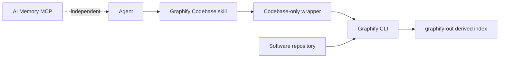

# Graphify Memory

Graphify Codebase builds and queries derived graphs for software repositories.
It is independent from AI Memory MCP.

Graphify Codebase does not store memories.
It does not save questions, answers, preferences, corrections, or session lessons.
Use the `ai-memory` skill for all durable-memory operations.

## Architecture



The wrapper accepts only codebase build and query operations.
The wrapper does not expose Graphify feedback or memory commands.

No custom Graphify data format exists in this project.
The wrapper uses the installed Graphify CLI and its standard `graphify-out` files.

## Canonical skill

The canonical skill is [skill/graphify/SKILL.md](skill/graphify/SKILL.md).
Each AI harness must contain only a discovery stub.

Use this stub pattern:

```markdown
---
name: graphify
description: <copy the exact canonical description>
---

Before following this stub, read the canonical `SKILL.md` in full from `<repository>/graphify-codebase/skill/graphify/SKILL.md`.
```

The repository path can change between computers.
Run the client installer after you move or clone the repository.

## Wrapper

Build a graph for a repository:

```powershell
.\graphify-codebase\scripts\invoke-graphify-codebase.ps1 -Mode Build -Path 'C:\path\to\repository'
```

```bash
./graphify-codebase/scripts/invoke-graphify-codebase.sh --mode build --path /path/to/repository
```

Query an existing repository graph:

```powershell
.\graphify-codebase\scripts\invoke-graphify-codebase.ps1 -Mode Query -Path 'C:\path\to\repository' -Question 'How does authentication work?'
```

```bash
./graphify-codebase/scripts/invoke-graphify-codebase.sh --mode query --path /path/to/repository --question 'How does authentication work?'
```

The wrapper never changes the indexed repository source files.
Graphify writes derived output under `graphify-out`.
